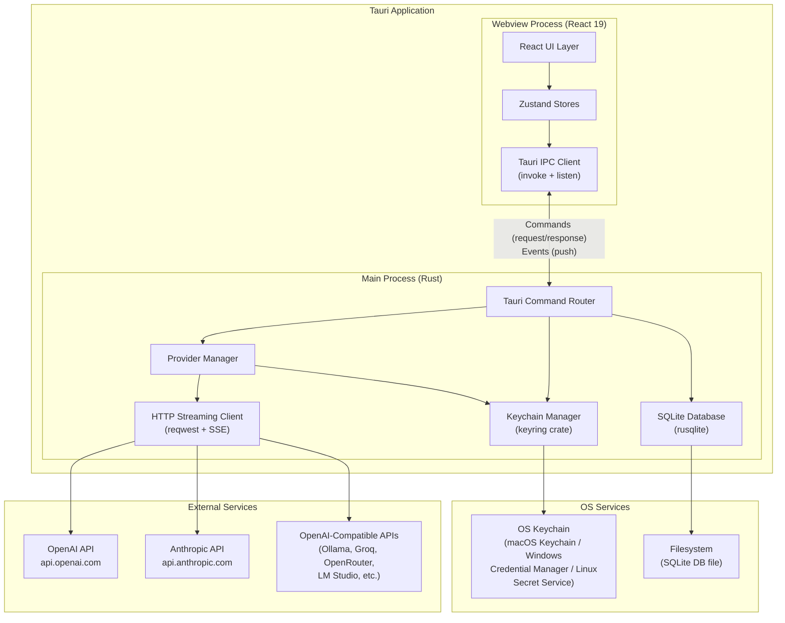
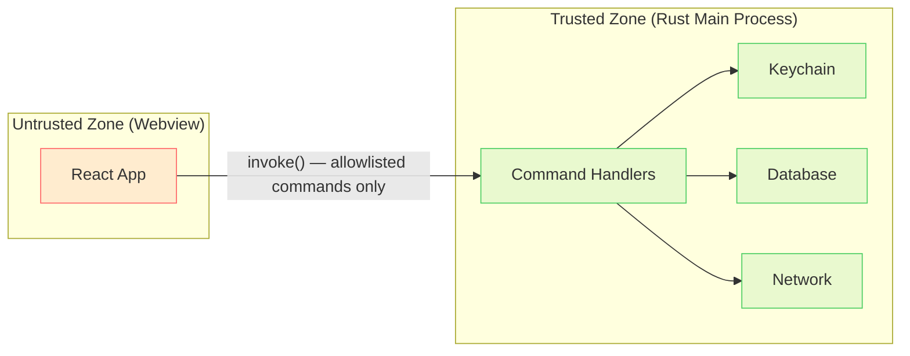
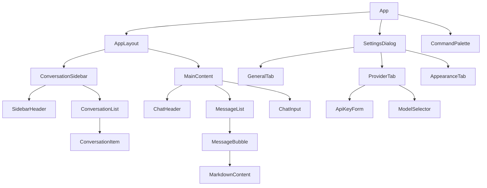
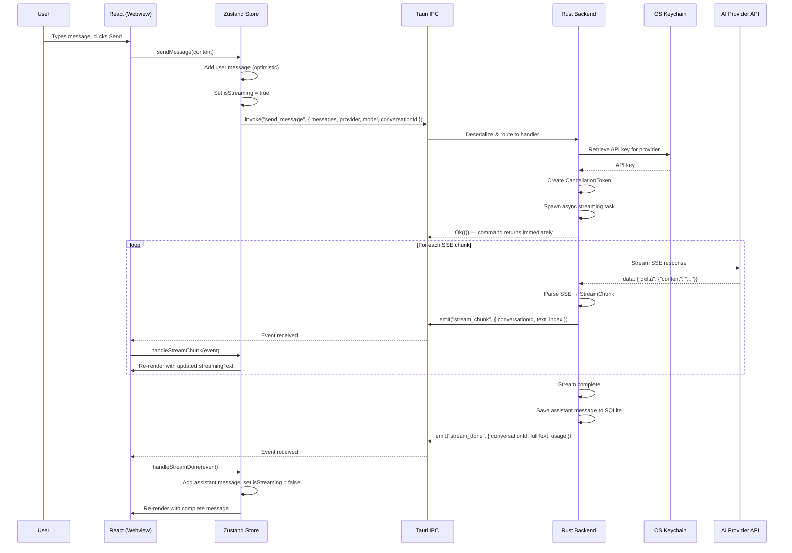
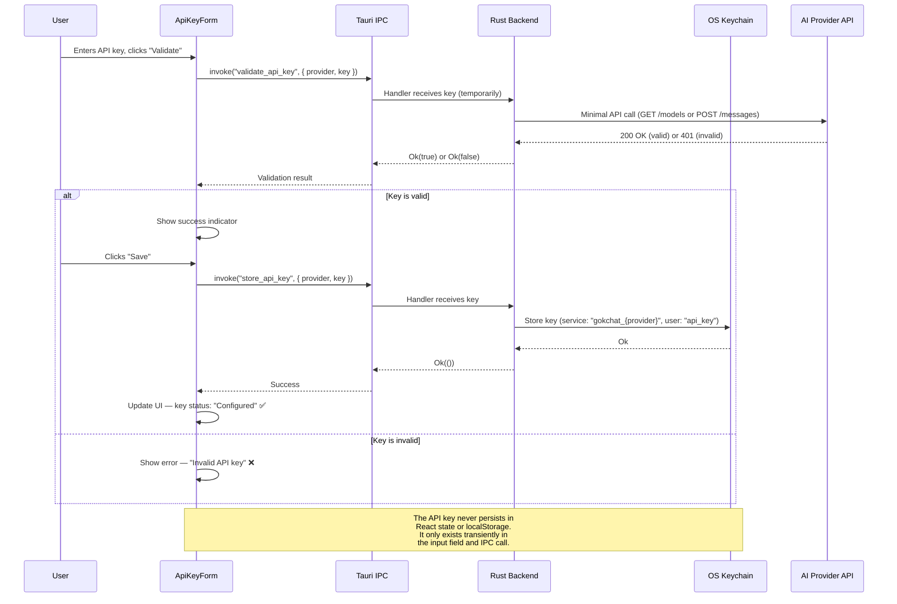

# GokChat — Technical Specification

> **Version:** 1.0.0-draft  
> **Last Updated:** 2026-07-02  
> **Stack:** Tauri 2.x · React 19 · Bun · Tailwind CSS v4 · shadcn/ui  
> **Target Platforms:** macOS (aarch64, x86_64), Windows (x86_64), Linux (x86_64)

---

## Table of Contents

1. [System Architecture](#1-system-architecture)
2. [Rust Backend Specification](#2-rust-backend-specification)
   - [Provider System](#21-provider-system)
   - [Tauri Commands (Full API Contract)](#22-tauri-commands-full-api-contract)
   - [Tauri Events (Push to Frontend)](#23-tauri-events-push-to-frontend)
   - [Database Schema (SQLite)](#24-database-schema-sqlite)
   - [Security Specification](#25-security-specification)
3. [Frontend Specification](#3-frontend-specification)
   - [State Management (Zustand)](#31-state-management-zustand)
   - [Key React Components](#32-key-react-components)
   - [Tauri IPC Wrapper](#33-tauri-ipc-wrapper-libtaurits)
4. [Rust Crate Dependencies](#4-rust-crate-dependencies)
5. [Frontend Dependencies](#5-frontend-dependencies)
6. [Configuration Files](#6-configuration-files)

---

## 1. System Architecture

### 1.1 High-Level Architecture Diagram



### 1.2 Process Model

GokChat runs as a Tauri 2.x application with two distinct processes:

| Process | Runtime | Responsibilities |
|---------|---------|------------------|
| **Main Process** | Rust (native binary) | API key storage, HTTP streaming, SQLite persistence, provider routing, security enforcement |
| **Webview Process** | Chromium-based webview (React 19) | Chat UI rendering, user input handling, settings management, conversation sidebar |

The main process is the **trust boundary owner**. All sensitive operations (key storage, network requests, database access) execute in Rust. The webview is treated as an **untrusted context** — it never directly touches API keys, the network, or the filesystem.

### 1.3 IPC Mechanism

Tauri 2.x provides two IPC primitives:

#### Commands (Request/Response)

- Frontend calls `invoke("command_name", { ...args })` → Rust handler executes → returns `Result<T, E>` serialized as JSON.
- Commands are defined with the `#[tauri::command]` macro.
- All commands are **async** in Rust (spawned on the Tokio runtime).
- Commands are registered in `tauri::Builder` via `.invoke_handler(tauri::generate_handler![...])`.

#### Events (Push from Backend)

- Backend emits events via `app_handle.emit("event_name", payload)` or `window.emit("event_name", payload)`.
- Frontend subscribes via `listen("event_name", callback)` which returns an `UnlistenFn`.
- Used for **streaming tokens** during generation — the frontend receives incremental `stream_chunk` events.
- Events are **fire-and-forget** (no acknowledgment from the frontend).

#### Serialization

- All IPC payloads are serialized/deserialized via `serde` (Rust) ↔ JSON ↔ TypeScript.
- Rust structs derive `Serialize, Deserialize` and use `#[serde(rename_all = "camelCase")]` to match TypeScript conventions.

### 1.4 Security Boundary



**Key security invariants:**

1. API keys **never** cross the IPC boundary to the frontend. The `get_api_key` command returns a `bool` (exists or not), never the key value.
2. The webview **cannot** make arbitrary network requests — all HTTP calls go through Rust's `reqwest` client.
3. SQLite database is accessed **only** from Rust. No filesystem access is exposed to the webview.
4. Tauri's **capability system** (v2) restricts which commands and events the webview can access.
5. Content Security Policy (CSP) prevents inline scripts and external resource loading.

---

## 2. Rust Backend Specification

### 2.1 Provider System

#### 2.1.1 Core Types

```rust
use serde::{Deserialize, Serialize};

/// Identifies a provider type.
#[derive(Debug, Clone, Serialize, Deserialize, PartialEq, Eq, Hash)]
#[serde(rename_all = "snake_case")]
pub enum ProviderType {
    OpenAI,
    Anthropic,
    OpenAICompatible,
}

/// A single message in a conversation.
#[derive(Debug, Clone, Serialize, Deserialize)]
#[serde(rename_all = "camelCase")]
pub struct ChatMessage {
    pub role: MessageRole,
    pub content: String,
}

#[derive(Debug, Clone, Serialize, Deserialize, PartialEq)]
#[serde(rename_all = "lowercase")]
pub enum MessageRole {
    System,
    User,
    Assistant,
}

/// Normalized streaming output chunk, emitted for every provider.
#[derive(Debug, Clone, Serialize, Deserialize)]
#[serde(rename_all = "camelCase")]
pub struct StreamChunk {
    /// The incremental text delta for this chunk.
    pub text: String,
    /// Monotonically increasing index within this generation.
    pub index: u32,
    /// Set to true on the final chunk.
    pub done: bool,
}

/// Token usage statistics returned after generation completes.
#[derive(Debug, Clone, Serialize, Deserialize, Default)]
#[serde(rename_all = "camelCase")]
pub struct TokenUsage {
    pub prompt_tokens: Option<u32>,
    pub completion_tokens: Option<u32>,
    pub total_tokens: Option<u32>,
}

/// Configuration for a provider instance.
#[derive(Debug, Clone, Serialize, Deserialize)]
#[serde(rename_all = "camelCase")]
pub struct ProviderConfig {
    pub provider_type: ProviderType,
    pub base_url: String,
    pub default_model: String,
    pub temperature: f32,
    pub max_tokens: u32,
    pub top_p: Option<f32>,
    pub frequency_penalty: Option<f32>,
    pub presence_penalty: Option<f32>,
}

/// Model info returned from provider model listing.
#[derive(Debug, Clone, Serialize, Deserialize)]
#[serde(rename_all = "camelCase")]
pub struct ModelInfo {
    pub id: String,
    pub name: String,
    pub provider: ProviderType,
    pub context_window: Option<u32>,
}
```

#### 2.1.2 ChatProvider Trait

```rust
use async_trait::async_trait;
use tokio::sync::mpsc;
use tokio_util::sync::CancellationToken;

/// Errors that can occur during provider operations.
#[derive(Debug, thiserror::Error)]
pub enum ProviderError {
    #[error("Authentication failed: invalid or expired API key")]
    AuthenticationError,

    #[error("Rate limited by provider (retry after {retry_after_ms}ms)")]
    RateLimited { retry_after_ms: u64 },

    #[error("Model '{model}' not found for provider '{provider}'")]
    ModelNotFound { model: String, provider: String },

    #[error("Context length exceeded: {message}")]
    ContextLengthExceeded { message: String },

    #[error("Provider returned error {status}: {message}")]
    ApiError { status: u16, message: String },

    #[error("Network error: {0}")]
    NetworkError(#[from] reqwest::Error),

    #[error("Stream cancelled by user")]
    Cancelled,

    #[error("Failed to parse SSE stream: {0}")]
    StreamParseError(String),

    #[error("Keychain error: {0}")]
    KeychainError(String),

    #[error("Invalid request: {0}")]
    InvalidRequest(String),
}

// Make ProviderError serializable for Tauri IPC
impl Serialize for ProviderError {
    fn serialize<S>(&self, serializer: S) -> Result<S::Ok, S::Error>
    where
        S: serde::Serializer,
    {
        use serde::ser::SerializeStruct;
        let mut state = serializer.serialize_struct("ProviderError", 2)?;
        state.serialize_field("code", &self.error_code())?;
        state.serialize_field("message", &self.to_string())?;
        state.end()
    }
}

impl ProviderError {
    pub fn error_code(&self) -> &'static str {
        match self {
            Self::AuthenticationError => "AUTH_ERROR",
            Self::RateLimited { .. } => "RATE_LIMITED",
            Self::ModelNotFound { .. } => "MODEL_NOT_FOUND",
            Self::ContextLengthExceeded { .. } => "CONTEXT_LENGTH_EXCEEDED",
            Self::ApiError { .. } => "API_ERROR",
            Self::NetworkError(_) => "NETWORK_ERROR",
            Self::Cancelled => "CANCELLED",
            Self::StreamParseError(_) => "STREAM_PARSE_ERROR",
            Self::KeychainError(_) => "KEYCHAIN_ERROR",
            Self::InvalidRequest(_) => "INVALID_REQUEST",
        }
    }

    /// Whether this error is retryable.
    pub fn is_retryable(&self) -> bool {
        matches!(
            self,
            Self::RateLimited { .. }
                | Self::NetworkError(_)
                | Self::ApiError { status, .. } if *status >= 500
        )
    }
}

/// The core trait that all AI providers must implement.
#[async_trait]
pub trait ChatProvider: Send + Sync {
    /// Stream a chat completion. Chunks are sent through the `tx` channel.
    /// The `cancel_token` can be used to abort the stream mid-generation.
    async fn stream_completion(
        &self,
        messages: Vec<ChatMessage>,
        model: &str,
        config: &ProviderConfig,
        api_key: &str,
        tx: mpsc::Sender<Result<StreamChunk, ProviderError>>,
        cancel_token: CancellationToken,
    ) -> Result<TokenUsage, ProviderError>;

    /// List available models from the provider.
    async fn list_models(&self, api_key: &str) -> Result<Vec<ModelInfo>, ProviderError>;

    /// Validate an API key by making a minimal API call.
    async fn validate_key(&self, api_key: &str) -> Result<bool, ProviderError>;

    /// Return the provider type.
    fn provider_type(&self) -> ProviderType;
}
```

#### 2.1.3 OpenAI Provider

```rust
pub struct OpenAIProvider {
    client: reqwest::Client,
    base_url: String, // Default: "https://api.openai.com/v1"
}

impl OpenAIProvider {
    pub fn new(base_url: Option<String>) -> Self {
        Self {
            client: reqwest::Client::new(),
            base_url: base_url.unwrap_or_else(|| "https://api.openai.com/v1".to_string()),
        }
    }
}
```

**Endpoint:** `POST {base_url}/chat/completions`

**Auth Header:**
```
Authorization: Bearer {api_key}
```

**Request Format:**
```json
{
  "model": "gpt-4o",
  "messages": [
    { "role": "system", "content": "You are a helpful assistant." },
    { "role": "user", "content": "Hello" }
  ],
  "stream": true,
  "temperature": 0.7,
  "max_tokens": 4096,
  "top_p": 1.0,
  "frequency_penalty": 0.0,
  "presence_penalty": 0.0,
  "stream_options": { "include_usage": true }
}
```

**SSE Parsing:**

OpenAI streams Server-Sent Events. Each event line is prefixed with `data: `:

```
data: {"id":"chatcmpl-abc","object":"chat.completion.chunk","choices":[{"index":0,"delta":{"content":"Hello"},"finish_reason":null}]}

data: {"id":"chatcmpl-abc","object":"chat.completion.chunk","choices":[{"index":0,"delta":{"content":" world"},"finish_reason":null}]}

data: {"id":"chatcmpl-abc","object":"chat.completion.chunk","choices":[{"index":0,"delta":{},"finish_reason":"stop"}],"usage":{"prompt_tokens":10,"completion_tokens":5,"total_tokens":15}}

data: [DONE]
```

**Parsing rules:**
1. Read lines from the byte stream. Lines starting with `data: ` contain payload.
2. If the line is `data: [DONE]`, the stream is complete.
3. Otherwise, parse the JSON payload. Extract `choices[0].delta.content` as the text delta.
4. If `choices[0].finish_reason` is non-null (`"stop"`, `"length"`, `"content_filter"`), the generation is complete.
5. If a `usage` field is present on the final chunk (when `stream_options.include_usage` is set), extract token counts.
6. Empty `data:` lines and comment lines (starting with `:`) are ignored.

**SSE parsing implementation (shared by OpenAI and OpenAI-compatible):**

```rust
use bytes::Bytes;
use futures_util::StreamExt;

async fn parse_openai_sse_stream(
    response: reqwest::Response,
    tx: mpsc::Sender<Result<StreamChunk, ProviderError>>,
    cancel_token: CancellationToken,
) -> Result<TokenUsage, ProviderError> {
    let mut stream = response.bytes_stream();
    let mut buffer = String::new();
    let mut chunk_index: u32 = 0;
    let mut usage = TokenUsage::default();

    loop {
        tokio::select! {
            _ = cancel_token.cancelled() => {
                return Err(ProviderError::Cancelled);
            }
            maybe_bytes = stream.next() => {
                match maybe_bytes {
                    Some(Ok(bytes)) => {
                        buffer.push_str(&String::from_utf8_lossy(&bytes));

                        // Process complete lines
                        while let Some(line_end) = buffer.find('\n') {
                            let line = buffer[..line_end].trim_end_matches('\r').to_string();
                            buffer = buffer[line_end + 1..].to_string();

                            if line.is_empty() || line.starts_with(':') {
                                continue;
                            }

                            if let Some(data) = line.strip_prefix("data: ") {
                                if data.trim() == "[DONE]" {
                                    let _ = tx.send(Ok(StreamChunk {
                                        text: String::new(),
                                        index: chunk_index,
                                        done: true,
                                    })).await;
                                    return Ok(usage);
                                }

                                match serde_json::from_str::<serde_json::Value>(data) {
                                    Ok(json) => {
                                        // Extract text delta
                                        if let Some(content) = json["choices"][0]["delta"]["content"]
                                            .as_str()
                                        {
                                            if !content.is_empty() {
                                                let _ = tx.send(Ok(StreamChunk {
                                                    text: content.to_string(),
                                                    index: chunk_index,
                                                    done: false,
                                                })).await;
                                                chunk_index += 1;
                                            }
                                        }

                                        // Extract usage if present
                                        if let Some(u) = json.get("usage") {
                                            usage.prompt_tokens = u["prompt_tokens"]
                                                .as_u64().map(|v| v as u32);
                                            usage.completion_tokens = u["completion_tokens"]
                                                .as_u64().map(|v| v as u32);
                                            usage.total_tokens = u["total_tokens"]
                                                .as_u64().map(|v| v as u32);
                                        }
                                    }
                                    Err(e) => {
                                        let _ = tx.send(Err(ProviderError::StreamParseError(
                                            format!("Invalid JSON in SSE: {e}")
                                        ))).await;
                                    }
                                }
                            }
                        }
                    }
                    Some(Err(e)) => return Err(ProviderError::NetworkError(e)),
                    None => return Ok(usage), // Stream ended
                }
            }
        }
    }
}
```

**Model Listing:**
```
GET {base_url}/models
Authorization: Bearer {api_key}
```
Response: `{ "data": [{ "id": "gpt-4o", "object": "model", ... }] }`

**Key Validation:**
Make a minimal request to `GET /v1/models` — a `200` response means the key is valid; `401` means invalid.

#### 2.1.4 Anthropic Provider

```rust
pub struct AnthropicProvider {
    client: reqwest::Client,
    base_url: String, // Default: "https://api.anthropic.com/v1"
    api_version: String, // Default: "2023-06-01"
}

impl AnthropicProvider {
    pub fn new() -> Self {
        Self {
            client: reqwest::Client::new(),
            base_url: "https://api.anthropic.com/v1".to_string(),
            api_version: "2023-06-01".to_string(),
        }
    }
}
```

**Endpoint:** `POST {base_url}/messages`

**Auth Headers:**
```
x-api-key: {api_key}
anthropic-version: 2023-06-01
Content-Type: application/json
```

> [!IMPORTANT]
> Anthropic uses `x-api-key` header — NOT `Authorization: Bearer`. The `anthropic-version` header is **required**.

**Request Format:**

```json
{
  "model": "claude-sonnet-4-20250514",
  "max_tokens": 4096,
  "system": "You are a helpful assistant.",
  "messages": [
    { "role": "user", "content": "Hello" },
    { "role": "assistant", "content": "Hi there!" },
    { "role": "user", "content": "How are you?" }
  ],
  "stream": true,
  "temperature": 0.7,
  "top_p": 1.0
}
```

> [!WARNING]
> **Anthropic API differences from OpenAI:**
> 1. `system` prompt is a **top-level field**, not a message in the `messages` array.
> 2. Messages must have **strictly alternating** `user`/`assistant` turns. The first message must be `role: "user"`.
> 3. The `max_tokens` field is **required** (not optional like OpenAI).
> 4. There is no `stream_options` field.

**Message Preprocessing:**

Before sending to Anthropic, the provider must:
1. Extract any `system` role message from the messages array and move it to the top-level `system` field.
2. Ensure strict alternation: if consecutive messages have the same role, merge their content with `\n\n` separator.
3. Ensure the first message is `role: "user"`. If the conversation starts with an assistant message, prepend a synthetic user message.

```rust
fn preprocess_for_anthropic(messages: Vec<ChatMessage>) -> (Option<String>, Vec<ChatMessage>) {
    let mut system_prompt: Option<String> = None;
    let mut processed: Vec<ChatMessage> = Vec::new();

    for msg in messages {
        if msg.role == MessageRole::System {
            // Accumulate system prompts
            match &mut system_prompt {
                Some(existing) => {
                    existing.push_str("\n\n");
                    existing.push_str(&msg.content);
                }
                None => system_prompt = Some(msg.content),
            }
            continue;
        }

        // Merge consecutive same-role messages
        if let Some(last) = processed.last_mut() {
            if last.role == msg.role {
                last.content.push_str("\n\n");
                last.content.push_str(&msg.content);
                continue;
            }
        }

        processed.push(msg);
    }

    // Ensure first message is user role
    if processed.first().map(|m| &m.role) != Some(&MessageRole::User) {
        processed.insert(0, ChatMessage {
            role: MessageRole::User,
            content: "(continued conversation)".to_string(),
        });
    }

    (system_prompt, processed)
}
```

**SSE Event Types:**

Anthropic uses named event types (not just `data:` lines):

```
event: message_start
data: {"type":"message_start","message":{"id":"msg_abc","type":"message","role":"assistant","content":[],"model":"claude-sonnet-4-20250514","usage":{"input_tokens":25,"output_tokens":1}}}

event: content_block_start
data: {"type":"content_block_start","index":0,"content_block":{"type":"text","text":""}}

event: content_block_delta
data: {"type":"content_block_delta","index":0,"delta":{"type":"text_delta","text":"Hello"}}

event: content_block_delta
data: {"type":"content_block_delta","index":0,"delta":{"type":"text_delta","text":" world"}}

event: content_block_stop
data: {"type":"content_block_stop","index":0}

event: message_delta
data: {"type":"message_delta","delta":{"stop_reason":"end_turn"},"usage":{"output_tokens":15}}

event: message_stop
data: {"type":"message_stop"}
```

**Parsing rules:**
1. Track current `event:` type. Process the `data:` line based on the preceding event type.
2. `message_start` → extract `usage.input_tokens` as `prompt_tokens`.
3. `content_block_delta` → extract `delta.text` as the text chunk. Only process `type: "text_delta"`.
4. `message_delta` → extract `usage.output_tokens` as `completion_tokens` and `delta.stop_reason`.
5. `message_stop` → stream is complete.
6. Ignore `ping` events.

```rust
async fn parse_anthropic_sse_stream(
    response: reqwest::Response,
    tx: mpsc::Sender<Result<StreamChunk, ProviderError>>,
    cancel_token: CancellationToken,
) -> Result<TokenUsage, ProviderError> {
    let mut stream = response.bytes_stream();
    let mut buffer = String::new();
    let mut chunk_index: u32 = 0;
    let mut usage = TokenUsage::default();
    let mut current_event_type = String::new();

    loop {
        tokio::select! {
            _ = cancel_token.cancelled() => {
                return Err(ProviderError::Cancelled);
            }
            maybe_bytes = stream.next() => {
                match maybe_bytes {
                    Some(Ok(bytes)) => {
                        buffer.push_str(&String::from_utf8_lossy(&bytes));

                        while let Some(line_end) = buffer.find('\n') {
                            let line = buffer[..line_end].trim_end_matches('\r').to_string();
                            buffer = buffer[line_end + 1..].to_string();

                            if line.is_empty() {
                                current_event_type.clear();
                                continue;
                            }

                            if let Some(event) = line.strip_prefix("event: ") {
                                current_event_type = event.trim().to_string();
                                continue;
                            }

                            if let Some(data) = line.strip_prefix("data: ") {
                                let json: serde_json::Value = serde_json::from_str(data)
                                    .map_err(|e| ProviderError::StreamParseError(
                                        format!("Invalid JSON: {e}")
                                    ))?;

                                match current_event_type.as_str() {
                                    "message_start" => {
                                        usage.prompt_tokens = json["message"]["usage"]["input_tokens"]
                                            .as_u64().map(|v| v as u32);
                                    }
                                    "content_block_delta" => {
                                        if let Some(text) = json["delta"]["text"].as_str() {
                                            if !text.is_empty() {
                                                let _ = tx.send(Ok(StreamChunk {
                                                    text: text.to_string(),
                                                    index: chunk_index,
                                                    done: false,
                                                })).await;
                                                chunk_index += 1;
                                            }
                                        }
                                    }
                                    "message_delta" => {
                                        usage.completion_tokens = json["usage"]["output_tokens"]
                                            .as_u64().map(|v| v as u32);
                                    }
                                    "message_stop" => {
                                        usage.total_tokens = match (
                                            usage.prompt_tokens,
                                            usage.completion_tokens,
                                        ) {
                                            (Some(p), Some(c)) => Some(p + c),
                                            _ => None,
                                        };

                                        let _ = tx.send(Ok(StreamChunk {
                                            text: String::new(),
                                            index: chunk_index,
                                            done: true,
                                        })).await;

                                        return Ok(usage);
                                    }
                                    _ => {} // ping, content_block_start, content_block_stop
                                }
                            }
                        }
                    }
                    Some(Err(e)) => return Err(ProviderError::NetworkError(e)),
                    None => return Ok(usage),
                }
            }
        }
    }
}
```

**Model Listing:**

Anthropic does not have a public `/models` endpoint. Return a hardcoded list:

```rust
fn anthropic_models() -> Vec<ModelInfo> {
    vec![
        ModelInfo {
            id: "claude-sonnet-4-20250514".into(),
            name: "Claude Sonnet 4".into(),
            provider: ProviderType::Anthropic,
            context_window: Some(200_000),
        },
        ModelInfo {
            id: "claude-opus-4-20250514".into(),
            name: "Claude Opus 4".into(),
            provider: ProviderType::Anthropic,
            context_window: Some(200_000),
        },
        ModelInfo {
            id: "claude-3-5-haiku-20241022".into(),
            name: "Claude 3.5 Haiku".into(),
            provider: ProviderType::Anthropic,
            context_window: Some(200_000),
        },
    ]
}
```

**Key Validation:**

Send a minimal message request with `max_tokens: 1`:
```json
{
  "model": "claude-3-5-haiku-20241022",
  "max_tokens": 1,
  "messages": [{ "role": "user", "content": "hi" }]
}
```
A `200` response (or `2xx`) means valid. A `401` means invalid key.

#### 2.1.5 OpenAI-Compatible Provider

```rust
pub struct OpenAICompatibleProvider {
    client: reqwest::Client,
    base_url: String, // User-configured, e.g., "http://localhost:11434/v1"
    name: String,     // Display name, e.g., "Ollama", "Groq"
}

impl OpenAICompatibleProvider {
    pub fn new(base_url: String, name: String) -> Self {
        Self {
            client: reqwest::Client::new(),
            base_url,
            name,
        }
    }
}
```

This provider **reuses the OpenAI request format and SSE parsing** but with a custom `base_url`. The key behavioral differences:

| Feature | Behavior |
|---------|----------|
| **Base URL** | User-configurable (not hardcoded) |
| **Auth** | `Authorization: Bearer {api_key}` — same as OpenAI. Some local providers (Ollama, LM Studio) accept any value or empty string. |
| **Model discovery** | `GET {base_url}/models` — dynamically fetches available models |
| **SSE parsing** | Identical to OpenAI (`data:` lines, `[DONE]` terminator) |
| **stream_options** | May not be supported — if the provider returns `400` with `stream_options`, retry without it |

**Model Discovery:**

```rust
async fn list_models_compatible(
    client: &reqwest::Client,
    base_url: &str,
    api_key: &str,
) -> Result<Vec<ModelInfo>, ProviderError> {
    let url = format!("{}/models", base_url.trim_end_matches('/'));

    let response = client
        .get(&url)
        .header("Authorization", format!("Bearer {}", api_key))
        .send()
        .await?;

    if !response.status().is_success() {
        return Err(ProviderError::ApiError {
            status: response.status().as_u16(),
            message: response.text().await.unwrap_or_default(),
        });
    }

    let body: serde_json::Value = response.json().await?;

    let models = body["data"]
        .as_array()
        .unwrap_or(&vec![])
        .iter()
        .filter_map(|m| {
            Some(ModelInfo {
                id: m["id"].as_str()?.to_string(),
                name: m["id"].as_str()?.to_string(),
                provider: ProviderType::OpenAICompatible,
                context_window: None,
            })
        })
        .collect();

    Ok(models)
}
```

#### 2.1.6 Error Handling & Retry Strategy

All providers use exponential backoff with jitter for retryable errors:

```rust
use std::time::Duration;
use rand::Rng;

pub struct RetryConfig {
    pub max_retries: u32,
    pub base_delay_ms: u64,
    pub max_delay_ms: u64,
}

impl Default for RetryConfig {
    fn default() -> Self {
        Self {
            max_retries: 3,
            base_delay_ms: 1000,
            max_delay_ms: 30_000,
        }
    }
}

impl RetryConfig {
    /// Compute delay for attempt `n` (0-indexed) with full jitter.
    pub fn delay_for_attempt(&self, attempt: u32) -> Duration {
        let exponential = self.base_delay_ms * 2u64.pow(attempt);
        let capped = exponential.min(self.max_delay_ms);
        let jitter = rand::thread_rng().gen_range(0..=capped);
        Duration::from_millis(jitter)
    }
}
```

**Retry conditions:**
- `429 Too Many Requests` → retry (respect `Retry-After` header if present, otherwise use backoff).
- `5xx` server errors → retry.
- `401 Unauthorized` → **do not retry** (auth error).
- `400 Bad Request` → **do not retry** (client error).
- Network timeout / connection reset → retry.
- Stream parse error → **do not retry**.

#### 2.1.7 Provider Manager

```rust
use std::collections::HashMap;
use std::sync::Arc;
use tokio::sync::RwLock;
use tokio_util::sync::CancellationToken;

pub struct ProviderManager {
    providers: HashMap<ProviderType, Arc<dyn ChatProvider>>,
    /// Active generation cancel tokens, keyed by conversation_id.
    active_streams: Arc<RwLock<HashMap<String, CancellationToken>>>,
}

impl ProviderManager {
    pub fn new() -> Self {
        let mut providers: HashMap<ProviderType, Arc<dyn ChatProvider>> = HashMap::new();
        providers.insert(
            ProviderType::OpenAI,
            Arc::new(OpenAIProvider::new(None)),
        );
        providers.insert(
            ProviderType::Anthropic,
            Arc::new(AnthropicProvider::new()),
        );
        // OpenAI-compatible providers are added dynamically via provider_configs

        Self {
            providers,
            active_streams: Arc::new(RwLock::new(HashMap::new())),
        }
    }

    pub fn get_provider(&self, provider_type: &ProviderType) -> Option<Arc<dyn ChatProvider>> {
        self.providers.get(provider_type).cloned()
    }

    pub async fn register_cancel_token(
        &self,
        conversation_id: &str,
        token: CancellationToken,
    ) {
        self.active_streams
            .write()
            .await
            .insert(conversation_id.to_string(), token);
    }

    pub async fn cancel_stream(&self, conversation_id: &str) -> bool {
        if let Some(token) = self.active_streams.write().await.remove(conversation_id) {
            token.cancel();
            true
        } else {
            false
        }
    }

    pub async fn remove_cancel_token(&self, conversation_id: &str) {
        self.active_streams.write().await.remove(conversation_id);
    }
}
```

---

### 2.2 Tauri Commands (Full API Contract)

All commands are registered in `src-tauri/src/lib.rs`:

```rust
pub fn run() {
    tauri::Builder::default()
        .plugin(tauri_plugin_shell::init())
        .manage(AppState::new())
        .invoke_handler(tauri::generate_handler![
            send_message,
            stop_generation,
            store_api_key,
            get_api_key,
            delete_api_key,
            validate_api_key,
            create_conversation,
            get_conversations,
            get_messages,
            delete_conversation,
            rename_conversation,
            export_conversation,
            list_models,
            get_settings,
            update_settings,
        ])
        .run(tauri::generate_context!())
        .expect("error while running tauri application");
}
```

#### Command 1: `send_message`

Initiates a streaming chat completion. Sends tokens to the frontend via events.

```rust
#[derive(Debug, Deserialize)]
#[serde(rename_all = "camelCase")]
pub struct SendMessageRequest {
    pub messages: Vec<ChatMessage>,
    pub provider: ProviderType,
    pub model: String,
    pub conversation_id: String,
    pub system_prompt: Option<String>,
    pub temperature: Option<f32>,
    pub max_tokens: Option<u32>,
}

#[tauri::command]
async fn send_message(
    app: tauri::AppHandle,
    state: tauri::State<'_, AppState>,
    request: SendMessageRequest,
) -> Result<(), ProviderError> { ... }
```

| Field | Type | Required | Description |
|-------|------|----------|-------------|
| `messages` | `ChatMessage[]` | ✅ | Full message history for this completion |
| `provider` | `ProviderType` | ✅ | Which provider to use |
| `model` | `string` | ✅ | Model ID (e.g., `"gpt-4o"`, `"claude-sonnet-4-20250514"`) |
| `conversationId` | `string` | ✅ | UUID of the conversation (used as event channel key) |
| `systemPrompt` | `string \| null` | ❌ | Optional system prompt override |
| `temperature` | `number \| null` | ❌ | Override provider config temperature |
| `maxTokens` | `number \| null` | ❌ | Override provider config max_tokens |

**Return:** `Result<(), ProviderError>` — the command itself returns immediately after spawning the stream task. Actual content is delivered via `stream_chunk`, `stream_error`, and `stream_done` events.

**Error Cases:**
- `AUTH_ERROR` — No API key stored for this provider.
- `MODEL_NOT_FOUND` — Invalid model ID.
- `NETWORK_ERROR` — Cannot reach provider endpoint.
- `RATE_LIMITED` — Provider returned 429 (after retries exhausted).
- `CONTEXT_LENGTH_EXCEEDED` — Message history exceeds model context window.

**Behavior:**
1. Retrieve API key from keychain for the given provider.
2. Create a `CancellationToken` and register it in `ProviderManager.active_streams`.
3. Spawn a Tokio task that:
   a. Calls `provider.stream_completion(...)` with a `mpsc::channel`.
   b. For each `StreamChunk` received, emits `stream_chunk` event to the frontend.
   c. On error, emits `stream_error` event.
   d. On completion, emits `stream_done` event with full text and usage.
   e. Saves the assistant message to SQLite.
   f. Removes the cancel token from `active_streams`.

---

#### Command 2: `stop_generation`

Cancels an active streaming generation.

```rust
#[tauri::command]
async fn stop_generation(
    state: tauri::State<'_, AppState>,
    conversation_id: String,
) -> Result<bool, ProviderError> { ... }
```

| Field | Type | Required | Description |
|-------|------|----------|-------------|
| `conversationId` | `string` | ✅ | UUID of the conversation to cancel |

**Return:** `Result<bool, ProviderError>` — `true` if a stream was actively cancelled, `false` if no active stream was found.

**Error Cases:** None expected (infallible cancellation).

---

#### Command 3: `store_api_key`

Stores an API key in the OS keychain.

```rust
#[tauri::command]
async fn store_api_key(
    provider: ProviderType,
    key: String,
) -> Result<(), ProviderError> { ... }
```

| Field | Type | Required | Description |
|-------|------|----------|-------------|
| `provider` | `ProviderType` | ✅ | Provider identifier (used as keychain service name) |
| `key` | `string` | ✅ | The raw API key string |

**Return:** `Result<(), ProviderError>`

**Keychain mapping:**
- Service name: `"gokchat_{provider}"` (e.g., `"gokchat_openai"`)
- Username: `"api_key"`

**Error Cases:**
- `KEYCHAIN_ERROR` — OS keychain is locked, unavailable, or access denied.

**Implementation:**

```rust
use keyring::Entry;

fn keychain_entry(provider: &ProviderType) -> Result<Entry, ProviderError> {
    let service = format!("gokchat_{}", serde_json::to_string(provider)
        .unwrap().trim_matches('"'));
    Entry::new(&service, "api_key")
        .map_err(|e| ProviderError::KeychainError(e.to_string()))
}
```

---

#### Command 4: `get_api_key`

Checks whether an API key exists for a provider. **Does NOT return the key itself.**

```rust
#[tauri::command]
async fn get_api_key(provider: ProviderType) -> Result<bool, ProviderError> { ... }
```

| Field | Type | Required | Description |
|-------|------|----------|-------------|
| `provider` | `ProviderType` | ✅ | Provider to check |

**Return:** `Result<bool, ProviderError>` — `true` if a key exists in the keychain, `false` otherwise.

> [!CAUTION]
> This command **intentionally** does not return the API key value. The key must never cross the IPC boundary. Only the Rust backend reads the key internally when making API calls.

---

#### Command 5: `delete_api_key`

Removes an API key from the OS keychain.

```rust
#[tauri::command]
async fn delete_api_key(provider: ProviderType) -> Result<(), ProviderError> { ... }
```

| Field | Type | Required | Description |
|-------|------|----------|-------------|
| `provider` | `ProviderType` | ✅ | Provider whose key to delete |

**Return:** `Result<(), ProviderError>`

**Error Cases:**
- `KEYCHAIN_ERROR` — Key doesn't exist or keychain access error.

---

#### Command 6: `validate_api_key`

Tests whether a provided API key is valid by making a minimal API call.

```rust
#[tauri::command]
async fn validate_api_key(
    state: tauri::State<'_, AppState>,
    provider: ProviderType,
    key: String,
) -> Result<bool, ProviderError> { ... }
```

| Field | Type | Required | Description |
|-------|------|----------|-------------|
| `provider` | `ProviderType` | ✅ | Provider to validate against |
| `key` | `string` | ✅ | The API key to test |

**Return:** `Result<bool, ProviderError>` — `true` if the key is valid and authorized.

> [!NOTE]
> The key is passed as a parameter here (not read from keychain) so the user can validate **before** storing. This is the one command where the key crosses IPC — it is used immediately and not persisted in memory.

**Validation strategy per provider:**
- **OpenAI:** `GET /v1/models` → 200 = valid, 401 = invalid.
- **Anthropic:** `POST /v1/messages` with `max_tokens: 1` → 200 = valid, 401 = invalid.
- **OpenAI-compatible:** `GET {base_url}/models` → 200 = valid, 401 = invalid.

---

#### Command 7: `create_conversation`

Creates a new conversation in the database.

```rust
#[derive(Debug, Serialize, Deserialize)]
#[serde(rename_all = "camelCase")]
pub struct Conversation {
    pub id: String,           // UUIDv4
    pub title: String,
    pub provider: ProviderType,
    pub model: String,
    pub system_prompt: Option<String>,
    pub created_at: String,   // ISO 8601
    pub updated_at: String,   // ISO 8601
    pub pinned: bool,
    pub archived: bool,
}

#[tauri::command]
async fn create_conversation(
    state: tauri::State<'_, AppState>,
    title: String,
    provider: ProviderType,
    model: String,
    system_prompt: Option<String>,
) -> Result<Conversation, ProviderError> { ... }
```

| Field | Type | Required | Description |
|-------|------|----------|-------------|
| `title` | `string` | ✅ | Conversation title (can be auto-generated later) |
| `provider` | `ProviderType` | ✅ | AI provider for this conversation |
| `model` | `string` | ✅ | Model ID to use |
| `systemPrompt` | `string \| null` | ❌ | Custom system prompt |

**Return:** `Result<Conversation, ProviderError>` — the created conversation with generated UUID and timestamps.

---

#### Command 8: `get_conversations`

Returns all conversations, ordered by `updated_at` descending.

```rust
#[tauri::command]
async fn get_conversations(
    state: tauri::State<'_, AppState>,
) -> Result<Vec<Conversation>, ProviderError> { ... }
```

**Return:** `Result<Vec<Conversation>, ProviderError>`

---

#### Command 9: `get_messages`

Returns all messages for a conversation, ordered by `created_at` ascending.

```rust
#[derive(Debug, Serialize, Deserialize)]
#[serde(rename_all = "camelCase")]
pub struct Message {
    pub id: String,             // UUIDv4
    pub conversation_id: String,
    pub role: MessageRole,
    pub content: String,
    pub tokens_used: Option<u32>,
    pub model: String,
    pub created_at: String,     // ISO 8601
}

#[tauri::command]
async fn get_messages(
    state: tauri::State<'_, AppState>,
    conversation_id: String,
) -> Result<Vec<Message>, ProviderError> { ... }
```

| Field | Type | Required | Description |
|-------|------|----------|-------------|
| `conversationId` | `string` | ✅ | UUID of the conversation |

**Return:** `Result<Vec<Message>, ProviderError>`

**Error Cases:**
- `INVALID_REQUEST` — conversation_id doesn't exist.

---

#### Command 10: `delete_conversation`

Deletes a conversation and all its messages (cascade delete).

```rust
#[tauri::command]
async fn delete_conversation(
    state: tauri::State<'_, AppState>,
    conversation_id: String,
) -> Result<(), ProviderError> { ... }
```

| Field | Type | Required | Description |
|-------|------|----------|-------------|
| `conversationId` | `string` | ✅ | UUID of the conversation to delete |

**Return:** `Result<(), ProviderError>`

---

#### Command 11: `rename_conversation`

Updates the title of an existing conversation.

```rust
#[tauri::command]
async fn rename_conversation(
    state: tauri::State<'_, AppState>,
    conversation_id: String,
    title: String,
) -> Result<(), ProviderError> { ... }
```

| Field | Type | Required | Description |
|-------|------|----------|-------------|
| `conversationId` | `string` | ✅ | UUID of the conversation |
| `title` | `string` | ✅ | New title |

**Return:** `Result<(), ProviderError>`

---

#### Command 12: `export_conversation`

Exports a conversation in the requested format.

```rust
#[derive(Debug, Deserialize)]
#[serde(rename_all = "lowercase")]
pub enum ExportFormat {
    Markdown,
    Json,
    Text,
}

#[tauri::command]
async fn export_conversation(
    state: tauri::State<'_, AppState>,
    conversation_id: String,
    format: ExportFormat,
) -> Result<String, ProviderError> { ... }
```

| Field | Type | Required | Description |
|-------|------|----------|-------------|
| `conversationId` | `string` | ✅ | UUID of the conversation |
| `format` | `ExportFormat` | ✅ | `"markdown"`, `"json"`, or `"text"` |

**Return:** `Result<String, ProviderError>` — the formatted conversation string.

**Format specifications:**

- **Markdown:**
  ```markdown
  # Conversation Title
  **Provider:** OpenAI | **Model:** gpt-4o | **Date:** 2026-07-02

  ---

  ## User
  Hello, how are you?

  ## Assistant
  I'm doing well, thank you!
  ```

- **JSON:**
  ```json
  {
    "title": "Conversation Title",
    "provider": "openai",
    "model": "gpt-4o",
    "exportedAt": "2026-07-02T15:00:00Z",
    "messages": [
      { "role": "user", "content": "Hello", "createdAt": "..." },
      { "role": "assistant", "content": "Hi!", "createdAt": "..." }
    ]
  }
  ```

- **Text:** Plain text with `User:` and `Assistant:` prefixes, separated by blank lines.

---

#### Command 13: `list_models`

Queries the provider for available models.

```rust
#[tauri::command]
async fn list_models(
    state: tauri::State<'_, AppState>,
    provider: ProviderType,
) -> Result<Vec<ModelInfo>, ProviderError> { ... }
```

| Field | Type | Required | Description |
|-------|------|----------|-------------|
| `provider` | `ProviderType` | ✅ | Provider to query |

**Return:** `Result<Vec<ModelInfo>, ProviderError>`

**Behavior per provider:**
- **OpenAI:** `GET /v1/models` — filtered to `gpt-*` models.
- **Anthropic:** Returns hardcoded model list (no public API).
- **OpenAI-compatible:** `GET {base_url}/models` — returns all models.

---

#### Command 14: `get_settings` / `update_settings`

```rust
#[derive(Debug, Serialize, Deserialize)]
#[serde(rename_all = "camelCase")]
pub struct AppSettings {
    pub theme: String,              // "system" | "light" | "dark"
    pub font_size: u32,             // 12-24, default 14
    pub send_on_enter: bool,        // default true
    pub stream_responses: bool,     // default true
    pub show_token_usage: bool,     // default true
    pub default_provider: Option<ProviderType>,
    pub default_model: Option<String>,
    pub default_system_prompt: Option<String>,
    pub compact_sidebar: bool,      // default false
    pub confirm_delete: bool,       // default true
    pub auto_title: bool,           // default true (auto-generate titles)
}

#[tauri::command]
async fn get_settings(
    state: tauri::State<'_, AppState>,
) -> Result<AppSettings, ProviderError> { ... }

#[tauri::command]
async fn update_settings(
    state: tauri::State<'_, AppState>,
    settings: AppSettings,
) -> Result<(), ProviderError> { ... }
```

**Return:** `get_settings` → `Result<AppSettings, ProviderError>`, `update_settings` → `Result<(), ProviderError>`

Settings are stored in the `app_settings` SQLite table as key-value pairs and deserialized/serialized as a struct.

---

### 2.3 Tauri Events (Push to Frontend)

Events are emitted from Rust to the webview during streaming generation. The frontend subscribes to these events filtered by `conversation_id`.

#### Event 1: `stream_chunk`

Emitted for each text delta received from the provider.

```rust
#[derive(Debug, Clone, Serialize)]
#[serde(rename_all = "camelCase")]
pub struct StreamChunkEvent {
    pub conversation_id: String,
    pub text: String,
    pub index: u32,
}
```

```typescript
// Frontend payload type
interface StreamChunkEvent {
  conversationId: string;
  text: string;   // Incremental text delta (NOT cumulative)
  index: number;  // Monotonically increasing chunk index
}
```

#### Event 2: `stream_error`

Emitted when an error occurs during streaming.

```rust
#[derive(Debug, Clone, Serialize)]
#[serde(rename_all = "camelCase")]
pub struct StreamErrorEvent {
    pub conversation_id: String,
    pub error_message: String,
    pub error_code: String,
}
```

```typescript
interface StreamErrorEvent {
  conversationId: string;
  errorMessage: string;
  errorCode: string; // One of the ProviderError codes
}
```

#### Event 3: `stream_done`

Emitted when streaming completes successfully.

```rust
#[derive(Debug, Clone, Serialize)]
#[serde(rename_all = "camelCase")]
pub struct StreamDoneEvent {
    pub conversation_id: String,
    pub full_text: String,
    pub usage: TokenUsage,
}
```

```typescript
interface StreamDoneEvent {
  conversationId: string;
  fullText: string;
  usage: {
    promptTokens: number | null;
    completionTokens: number | null;
    totalTokens: number | null;
  };
}
```

**Event emission in Rust:**

```rust
use tauri::Emitter;

// Inside the streaming task:
app_handle.emit("stream_chunk", StreamChunkEvent {
    conversation_id: conversation_id.clone(),
    text: chunk.text,
    index: chunk.index,
})?;

app_handle.emit("stream_done", StreamDoneEvent {
    conversation_id: conversation_id.clone(),
    full_text: accumulated_text,
    usage,
})?;
```

---

### 2.4 Database Schema (SQLite)

The SQLite database is stored at `{app_data_dir}/gokchat.db` using `rusqlite`. All tables use WAL mode for concurrent read/write performance.

```sql
-- Enable WAL mode for better concurrent access
PRAGMA journal_mode = WAL;
PRAGMA foreign_keys = ON;

-- ============================================================
-- conversations
-- Stores metadata about each chat conversation.
-- ============================================================
CREATE TABLE IF NOT EXISTS conversations (
    id              TEXT PRIMARY KEY NOT NULL,       -- UUIDv4
    title           TEXT NOT NULL DEFAULT 'New Chat',
    provider        TEXT NOT NULL,                   -- 'openai' | 'anthropic' | 'openai_compatible'
    model           TEXT NOT NULL,                   -- e.g., 'gpt-4o', 'claude-sonnet-4-20250514'
    system_prompt   TEXT,                            -- Custom system prompt, nullable
    created_at      TEXT NOT NULL DEFAULT (strftime('%Y-%m-%dT%H:%M:%fZ', 'now')),
    updated_at      TEXT NOT NULL DEFAULT (strftime('%Y-%m-%dT%H:%M:%fZ', 'now')),
    pinned          INTEGER NOT NULL DEFAULT 0,      -- 0 = false, 1 = true
    archived        INTEGER NOT NULL DEFAULT 0       -- 0 = false, 1 = true
);

CREATE INDEX idx_conversations_updated_at ON conversations(updated_at DESC);
CREATE INDEX idx_conversations_pinned ON conversations(pinned);
CREATE INDEX idx_conversations_archived ON conversations(archived);

-- ============================================================
-- messages
-- Stores individual messages within a conversation.
-- ============================================================
CREATE TABLE IF NOT EXISTS messages (
    id              TEXT PRIMARY KEY NOT NULL,       -- UUIDv4
    conversation_id TEXT NOT NULL,
    role            TEXT NOT NULL CHECK (role IN ('system', 'user', 'assistant')),
    content         TEXT NOT NULL,
    tokens_used     INTEGER,                         -- Token count for this message, nullable
    model           TEXT NOT NULL,                   -- Model that generated/received this message
    created_at      TEXT NOT NULL DEFAULT (strftime('%Y-%m-%dT%H:%M:%fZ', 'now')),

    FOREIGN KEY (conversation_id) REFERENCES conversations(id) ON DELETE CASCADE
);

CREATE INDEX idx_messages_conversation_id ON messages(conversation_id);
CREATE INDEX idx_messages_created_at ON messages(conversation_id, created_at ASC);

-- ============================================================
-- provider_configs
-- Stores per-provider configuration (base URL, defaults).
-- ============================================================
CREATE TABLE IF NOT EXISTS provider_configs (
    provider        TEXT PRIMARY KEY NOT NULL,       -- 'openai' | 'anthropic' | 'openai_compatible'
    base_url        TEXT NOT NULL,
    default_model   TEXT NOT NULL,
    temperature     REAL NOT NULL DEFAULT 0.7,
    max_tokens      INTEGER NOT NULL DEFAULT 4096,
    top_p           REAL,
    frequency_penalty REAL,
    presence_penalty  REAL,
    custom_name     TEXT                             -- Display name for openai_compatible providers
);

-- Seed default configurations
INSERT OR IGNORE INTO provider_configs (provider, base_url, default_model, temperature, max_tokens)
VALUES
    ('openai', 'https://api.openai.com/v1', 'gpt-4o', 0.7, 4096),
    ('anthropic', 'https://api.anthropic.com/v1', 'claude-sonnet-4-20250514', 0.7, 4096),
    ('openai_compatible', 'http://localhost:11434/v1', 'llama3.1', 0.7, 4096);

-- ============================================================
-- app_settings
-- Key-value store for application preferences.
-- ============================================================
CREATE TABLE IF NOT EXISTS app_settings (
    key             TEXT PRIMARY KEY NOT NULL,
    value           TEXT NOT NULL                    -- JSON-encoded value
);

-- Seed default settings
INSERT OR IGNORE INTO app_settings (key, value) VALUES
    ('theme', '"system"'),
    ('font_size', '14'),
    ('send_on_enter', 'true'),
    ('stream_responses', 'true'),
    ('show_token_usage', 'true'),
    ('default_provider', 'null'),
    ('default_model', 'null'),
    ('default_system_prompt', 'null'),
    ('compact_sidebar', 'false'),
    ('confirm_delete', 'true'),
    ('auto_title', 'true');
```

**Database initialization in Rust:**

```rust
use rusqlite::Connection;
use std::sync::Mutex;
use tauri::Manager;

pub struct Database {
    conn: Mutex<Connection>,
}

impl Database {
    pub fn new(app_handle: &tauri::AppHandle) -> Result<Self, rusqlite::Error> {
        let app_data_dir = app_handle
            .path()
            .app_data_dir()
            .expect("failed to get app data dir");
        std::fs::create_dir_all(&app_data_dir).ok();

        let db_path = app_data_dir.join("gokchat.db");
        let conn = Connection::open(db_path)?;

        // Run migrations
        conn.execute_batch(include_str!("../migrations/001_init.sql"))?;

        Ok(Self {
            conn: Mutex::new(conn),
        })
    }
}
```

---

### 2.5 Security Specification

#### 2.5.1 Keychain Storage

API keys are stored using the `keyring` crate, which maps to the native OS credential store:

| OS | Backend | Storage Location |
|----|---------|-----------------|
| macOS | macOS Keychain (Security.framework) | `~/Library/Keychains/login.keychain-db` |
| Windows | Windows Credential Manager (DPAPI) | Windows Credential Locker |
| Linux | Secret Service (via D-Bus) / `libsecret` | GNOME Keyring / KDE Wallet |

**Keychain entry format:**
- **Service:** `gokchat_openai`, `gokchat_anthropic`, `gokchat_openai_compatible`
- **Username:** `api_key`
- **Password:** The raw API key string

> [!CAUTION]
> **Why localStorage / sessionStorage must NOT be used for API keys:**
> 1. **XSS vulnerability:** Any XSS exploit in the webview can read `localStorage`. Since the webview renders markdown (potentially user-supplied or AI-generated), the attack surface is significant.
> 2. **No encryption:** `localStorage` stores data as plaintext in a SQLite database within the webview profile directory. Anyone with filesystem access can read it.
> 3. **No access control:** There is no OS-level permission gate — any process running as the same user can read the webview's storage.
> 4. **Persistence:** `localStorage` survives across sessions with no expiration mechanism.
> 5. **No audit trail:** OS keychains provide access logging; `localStorage` does not.
>
> The OS keychain provides **encryption at rest**, **OS-level access control** (apps must be codesigned or explicitly authorized), and **user authentication** (biometrics / password) for access.

#### 2.5.2 Tauri Capabilities (Permissions)

Tauri 2.x uses a capability-based security model. Capabilities are defined in `src-tauri/capabilities/default.json`:

```json
{
  "$schema": "../gen/schemas/desktop-schema.json",
  "identifier": "default",
  "description": "Default permissions for GokChat",
  "windows": ["main"],
  "permissions": [
    "core:default",
    "core:window:default",
    "core:window:allow-close",
    "core:window:allow-set-title",
    "core:window:allow-set-size",
    "core:window:allow-toggle-maximize",
    "core:window:allow-minimize",
    "core:event:default",
    "core:event:allow-listen",
    "core:event:allow-emit",
    "shell:allow-open"
  ]
}
```

> [!IMPORTANT]
> The following are **explicitly NOT included**:
> - `fs:default` — No filesystem access from the webview.
> - `http:default` — No direct HTTP requests from the webview (all network calls go through Rust).
> - `clipboard:default` — Only if clipboard support is added later.
> - `shell:allow-execute` — No arbitrary shell command execution.

#### 2.5.3 Content Security Policy (CSP)

Configured in `tauri.conf.json` under `app.security.csp`:

```
default-src 'self';
script-src 'self';
style-src 'self' 'unsafe-inline' https://fonts.googleapis.com;
font-src 'self' https://fonts.gstatic.com;
img-src 'self' data: blob:;
connect-src ipc: http://ipc.localhost;
```

**CSP breakdown:**
- `default-src 'self'` — Only load resources from the app bundle.
- `script-src 'self'` — No inline scripts, no `eval()`, no external scripts.
- `style-src 'self' 'unsafe-inline'` — Allow inline styles (required by many UI libraries). Google Fonts allowed for typography.
- `font-src 'self' https://fonts.gstatic.com` — App bundle fonts + Google Fonts CDN.
- `img-src 'self' data: blob:` — App bundle images + data URIs (for inline SVGs) + blob URIs (for dynamic image generation).
- `connect-src ipc: http://ipc.localhost` — Only allow Tauri IPC communication. **No external HTTP from the webview.**

#### 2.5.4 Additional Security Measures

1. **Input sanitization:** All user input rendered in the chat UI is sanitized before DOM insertion. Markdown rendering uses a library with HTML sanitization enabled (no raw HTML pass-through).
2. **SQL injection prevention:** All database queries use parameterized statements (`?` placeholders). No string interpolation in SQL.
3. **Memory safety:** API keys read from the keychain in Rust are kept in `String` (heap-allocated) and dropped after use. They are never logged or serialized to disk.
4. **No telemetry:** The app makes no network requests except to user-configured AI provider endpoints.

---

## 3. Frontend Specification

### 3.1 State Management (Zustand)

#### 3.1.1 Chat Store

```typescript
// src/stores/chatStore.ts
import { create } from 'zustand';
import { immer } from 'zustand/middleware/immer';

interface ChatStore {
  // --- State ---
  conversations: Conversation[];
  activeConversationId: string | null;
  messages: Record<string, Message[]>;   // keyed by conversationId
  isStreaming: boolean;
  streamingText: string;                 // Accumulated text for current stream
  streamingConversationId: string | null;
  error: string | null;

  // --- Computed (selectors) ---
  // Use these via: useChatStore(state => state.activeConversation)
  activeConversation: Conversation | null;
  activeMessages: Message[];
  sortedConversations: Conversation[];   // Pinned first, then by updatedAt desc

  // --- Actions ---
  loadConversations: () => Promise<void>;
  createConversation: (
    title: string,
    provider: ProviderType,
    model: string,
    systemPrompt?: string,
  ) => Promise<Conversation>;
  setActiveConversation: (id: string | null) => void;
  loadMessages: (conversationId: string) => Promise<void>;
  sendMessage: (content: string) => Promise<void>;
  stopGeneration: () => Promise<void>;
  deleteConversation: (id: string) => Promise<void>;
  renameConversation: (id: string, title: string) => Promise<void>;
  exportConversation: (id: string, format: ExportFormat) => Promise<string>;

  // --- Stream event handlers (called by event listeners) ---
  handleStreamChunk: (event: StreamChunkEvent) => void;
  handleStreamError: (event: StreamErrorEvent) => void;
  handleStreamDone: (event: StreamDoneEvent) => void;

  // --- Internal ---
  clearError: () => void;
  reset: () => void;
}

export const useChatStore = create<ChatStore>()(
  immer((set, get) => ({
    // Initial state
    conversations: [],
    activeConversationId: null,
    messages: {},
    isStreaming: false,
    streamingText: '',
    streamingConversationId: null,
    error: null,

    // Selectors
    get activeConversation() {
      const { conversations, activeConversationId } = get();
      return conversations.find(c => c.id === activeConversationId) ?? null;
    },

    get activeMessages() {
      const { messages, activeConversationId } = get();
      if (!activeConversationId) return [];
      return messages[activeConversationId] ?? [];
    },

    get sortedConversations() {
      const { conversations } = get();
      return [...conversations].sort((a, b) => {
        if (a.pinned !== b.pinned) return a.pinned ? -1 : 1;
        return new Date(b.updatedAt).getTime() - new Date(a.updatedAt).getTime();
      });
    },

    // --- Action implementations ---
    async loadConversations() {
      const conversations = await tauriInvoke<Conversation[]>('get_conversations');
      set({ conversations });
    },

    async createConversation(title, provider, model, systemPrompt) {
      const conversation = await tauriInvoke<Conversation>('create_conversation', {
        title,
        provider,
        model,
        systemPrompt,
      });
      set(state => {
        state.conversations.unshift(conversation);
        state.activeConversationId = conversation.id;
      });
      return conversation;
    },

    setActiveConversation(id) {
      set({ activeConversationId: id });
      if (id) get().loadMessages(id);
    },

    async loadMessages(conversationId) {
      const msgs = await tauriInvoke<Message[]>('get_messages', { conversationId });
      set(state => {
        state.messages[conversationId] = msgs;
      });
    },

    async sendMessage(content) {
      const { activeConversation, activeMessages } = get();
      if (!activeConversation) return;

      // Add user message to local state immediately (optimistic)
      const userMessage: Message = {
        id: crypto.randomUUID(),
        conversationId: activeConversation.id,
        role: 'user',
        content,
        tokensUsed: null,
        model: activeConversation.model,
        createdAt: new Date().toISOString(),
      };

      set(state => {
        const convMessages = state.messages[activeConversation.id] ?? [];
        convMessages.push(userMessage);
        state.messages[activeConversation.id] = convMessages;
        state.isStreaming = true;
        state.streamingText = '';
        state.streamingConversationId = activeConversation.id;
      });

      // Build message array for the API
      const allMessages: ChatMessage[] = [
        ...activeMessages.map(m => ({ role: m.role, content: m.content })),
        { role: 'user' as const, content },
      ];

      await tauriInvoke('send_message', {
        messages: allMessages,
        provider: activeConversation.provider,
        model: activeConversation.model,
        conversationId: activeConversation.id,
        systemPrompt: activeConversation.systemPrompt,
      });
    },

    async stopGeneration() {
      const { streamingConversationId } = get();
      if (streamingConversationId) {
        await tauriInvoke('stop_generation', {
          conversationId: streamingConversationId,
        });
        set({ isStreaming: false, streamingConversationId: null });
      }
    },

    handleStreamChunk(event) {
      if (event.conversationId !== get().streamingConversationId) return;
      set(state => {
        state.streamingText += event.text;
      });
    },

    handleStreamError(event) {
      if (event.conversationId !== get().streamingConversationId) return;
      set({
        isStreaming: false,
        streamingConversationId: null,
        error: event.errorMessage,
      });
    },

    handleStreamDone(event) {
      if (event.conversationId !== get().streamingConversationId) return;

      const assistantMessage: Message = {
        id: crypto.randomUUID(),
        conversationId: event.conversationId,
        role: 'assistant',
        content: event.fullText,
        tokensUsed: event.usage.totalTokens,
        model: get().activeConversation?.model ?? '',
        createdAt: new Date().toISOString(),
      };

      set(state => {
        const convMessages = state.messages[event.conversationId] ?? [];
        convMessages.push(assistantMessage);
        state.messages[event.conversationId] = convMessages;
        state.isStreaming = false;
        state.streamingText = '';
        state.streamingConversationId = null;
      });
    },

    async deleteConversation(id) {
      await tauriInvoke('delete_conversation', { conversationId: id });
      set(state => {
        state.conversations = state.conversations.filter(c => c.id !== id);
        delete state.messages[id];
        if (state.activeConversationId === id) {
          state.activeConversationId = state.conversations[0]?.id ?? null;
        }
      });
    },

    async renameConversation(id, title) {
      await tauriInvoke('rename_conversation', { conversationId: id, title });
      set(state => {
        const conv = state.conversations.find(c => c.id === id);
        if (conv) conv.title = title;
      });
    },

    async exportConversation(id, format) {
      return tauriInvoke<string>('export_conversation', {
        conversationId: id,
        format,
      });
    },

    clearError() { set({ error: null }); },
    reset() {
      set({
        conversations: [],
        activeConversationId: null,
        messages: {},
        isStreaming: false,
        streamingText: '',
        streamingConversationId: null,
        error: null,
      });
    },
  }))
);
```

#### 3.1.2 Settings Store

```typescript
// src/stores/settingsStore.ts
import { create } from 'zustand';
import { immer } from 'zustand/middleware/immer';

interface ProviderStatus {
  hasKey: boolean;
  baseUrl: string;
  defaultModel: string;
}

interface SettingsStore {
  // --- State ---
  theme: 'system' | 'light' | 'dark';
  fontSize: number;
  sendOnEnter: boolean;
  streamResponses: boolean;
  showTokenUsage: boolean;
  defaultProvider: ProviderType | null;
  defaultModel: string | null;
  defaultSystemPrompt: string | null;
  compactSidebar: boolean;
  confirmDelete: boolean;
  autoTitle: boolean;

  providers: Record<ProviderType, ProviderStatus>;
  activeProvider: ProviderType;
  availableModels: Record<ProviderType, ModelInfo[]>;

  isSettingsOpen: boolean;
  settingsTab: 'general' | 'providers' | 'appearance';

  // --- Actions ---
  loadSettings: () => Promise<void>;
  updateSettings: (partial: Partial<AppSettings>) => Promise<void>;
  setTheme: (theme: 'system' | 'light' | 'dark') => void;
  setActiveProvider: (provider: ProviderType) => void;

  checkApiKey: (provider: ProviderType) => Promise<boolean>;
  storeApiKey: (provider: ProviderType, key: string) => Promise<void>;
  deleteApiKey: (provider: ProviderType) => Promise<void>;
  validateApiKey: (provider: ProviderType, key: string) => Promise<boolean>;

  loadModels: (provider: ProviderType) => Promise<void>;

  openSettings: (tab?: 'general' | 'providers' | 'appearance') => void;
  closeSettings: () => void;
}

export const useSettingsStore = create<SettingsStore>()(
  immer((set, get) => ({
    // Defaults
    theme: 'system',
    fontSize: 14,
    sendOnEnter: true,
    streamResponses: true,
    showTokenUsage: true,
    defaultProvider: null,
    defaultModel: null,
    defaultSystemPrompt: null,
    compactSidebar: false,
    confirmDelete: true,
    autoTitle: true,

    providers: {
      openai: { hasKey: false, baseUrl: 'https://api.openai.com/v1', defaultModel: 'gpt-4o' },
      anthropic: { hasKey: false, baseUrl: 'https://api.anthropic.com/v1', defaultModel: 'claude-sonnet-4-20250514' },
      openai_compatible: { hasKey: false, baseUrl: 'http://localhost:11434/v1', defaultModel: 'llama3.1' },
    },
    activeProvider: 'openai',
    availableModels: { openai: [], anthropic: [], openai_compatible: [] },

    isSettingsOpen: false,
    settingsTab: 'general',

    async loadSettings() {
      const settings = await tauriInvoke<AppSettings>('get_settings');
      set(state => {
        Object.assign(state, settings);
      });

      // Check key status for all providers
      for (const provider of ['openai', 'anthropic', 'openai_compatible'] as ProviderType[]) {
        const hasKey = await tauriInvoke<boolean>('get_api_key', { provider });
        set(state => {
          state.providers[provider].hasKey = hasKey;
        });
      }
    },

    async updateSettings(partial) {
      const current = get();
      const merged: AppSettings = {
        theme: partial.theme ?? current.theme,
        fontSize: partial.fontSize ?? current.fontSize,
        sendOnEnter: partial.sendOnEnter ?? current.sendOnEnter,
        streamResponses: partial.streamResponses ?? current.streamResponses,
        showTokenUsage: partial.showTokenUsage ?? current.showTokenUsage,
        defaultProvider: partial.defaultProvider ?? current.defaultProvider,
        defaultModel: partial.defaultModel ?? current.defaultModel,
        defaultSystemPrompt: partial.defaultSystemPrompt ?? current.defaultSystemPrompt,
        compactSidebar: partial.compactSidebar ?? current.compactSidebar,
        confirmDelete: partial.confirmDelete ?? current.confirmDelete,
        autoTitle: partial.autoTitle ?? current.autoTitle,
      };
      await tauriInvoke('update_settings', { settings: merged });
      set(state => { Object.assign(state, merged); });
    },

    setTheme(theme) {
      get().updateSettings({ theme });
    },

    setActiveProvider(provider) {
      set({ activeProvider: provider });
    },

    async checkApiKey(provider) {
      const hasKey = await tauriInvoke<boolean>('get_api_key', { provider });
      set(state => { state.providers[provider].hasKey = hasKey; });
      return hasKey;
    },

    async storeApiKey(provider, key) {
      await tauriInvoke('store_api_key', { provider, key });
      set(state => { state.providers[provider].hasKey = true; });
    },

    async deleteApiKey(provider) {
      await tauriInvoke('delete_api_key', { provider });
      set(state => { state.providers[provider].hasKey = false; });
    },

    async validateApiKey(provider, key) {
      return tauriInvoke<boolean>('validate_api_key', { provider, key });
    },

    async loadModels(provider) {
      const models = await tauriInvoke<ModelInfo[]>('list_models', { provider });
      set(state => { state.availableModels[provider] = models; });
    },

    openSettings(tab = 'general') {
      set({ isSettingsOpen: true, settingsTab: tab });
    },
    closeSettings() {
      set({ isSettingsOpen: false });
    },
  }))
);
```

---

### 3.2 Key React Components

#### Component Architecture



#### Component Specifications

---

##### `App` — Root Component

```typescript
// src/App.tsx
interface AppProps {}
```

**Responsibilities:**
- Initialize stores on mount (`loadSettings()`, `loadConversations()`).
- Set up Tauri event listeners (`stream_chunk`, `stream_error`, `stream_done`).
- Apply theme class to `<html>` element.
- Render `AppLayout`, `SettingsDialog`, and `CommandPalette`.

**Key interactions:**
- Subscribes to stream events via `listen()` on mount, unsubscribes on unmount.
- Routes stream events to `chatStore.handleStreamChunk/Error/Done`.

---

##### `AppLayout` — Shell Layout

```typescript
interface AppLayoutProps {
  children?: React.ReactNode;
}
```

**Responsibilities:**
- Two-column layout: sidebar (resizable, 240-400px) + main content area.
- Handles sidebar collapse/expand toggle.
- Drag region for Tauri window title bar (custom title bar).

---

##### `ConversationSidebar` — Left Panel

```typescript
interface ConversationSidebarProps {
  isCollapsed: boolean;
  onToggleCollapse: () => void;
}
```

**Responsibilities:**
- "New Chat" button at top.
- Scrollable list of conversations grouped by date (Today, Yesterday, Previous 7 Days, Older).
- Search/filter conversations by title.
- Right-click context menu on items (Rename, Pin, Archive, Export, Delete).
- Displays provider icon badge on each conversation.

---

##### `ConversationItem` — Sidebar Item

```typescript
interface ConversationItemProps {
  conversation: Conversation;
  isActive: boolean;
  onSelect: (id: string) => void;
  onRename: (id: string) => void;
  onDelete: (id: string) => void;
  onExport: (id: string) => void;
}
```

**Responsibilities:**
- Displays conversation title (truncated), provider icon, and relative timestamp.
- Active state styling.
- Inline rename on double-click.
- Shows pin indicator if pinned.

---

##### `ChatHeader` — Top Bar of Chat Area

```typescript
interface ChatHeaderProps {
  conversation: Conversation | null;
  onOpenSettings: () => void;
}
```

**Responsibilities:**
- Displays current model name and provider.
- Model switcher dropdown (within the same provider).
- System prompt edit button (opens modal).
- Settings gear icon.

---

##### `MessageList` — Chat Messages Container

```typescript
interface MessageListProps {
  messages: Message[];
  isStreaming: boolean;
  streamingText: string;
}
```

**Responsibilities:**
- Scrollable container that auto-scrolls to bottom on new messages.
- Renders `MessageBubble` for each message.
- Shows streaming message with typing indicator while `isStreaming`.
- Empty state when no messages ("Start a conversation...").
- "Scroll to bottom" floating button when not at bottom.

**Performance:**
- Uses `react-window` or similar for virtualization if conversation exceeds 100 messages.
- Memoizes individual `MessageBubble` components.

---

##### `MessageBubble` — Individual Message

```typescript
interface MessageBubbleProps {
  message: Message;
  isStreaming?: boolean;
}
```

**Responsibilities:**
- Different styling for user vs assistant messages (alignment, background).
- Renders message content as Markdown (using `react-markdown` + `remark-gfm` + `rehype-highlight`).
- Code blocks with syntax highlighting and copy button.
- Action buttons on hover: Copy, Retry (for assistant), Edit (for user).
- Token usage display if available and `showTokenUsage` setting is enabled.
- Timestamp tooltip on hover.

---

##### `MarkdownContent` — Markdown Renderer

```typescript
interface MarkdownContentProps {
  content: string;
}
```

**Responsibilities:**
- Renders Markdown to React elements safely.
- Syntax highlighting for code blocks (via `rehype-highlight` or `shiki`).
- Copy button on code blocks.
- Table rendering with horizontal scroll.
- LaTeX/math rendering (optional, via `remark-math` + `rehype-katex`).
- Link handling: external links open in default browser via Tauri `shell.open()`.
- **Security:** HTML sanitization enabled — no raw HTML pass-through.

---

##### `ChatInput` — Message Input Area

```typescript
interface ChatInputProps {
  onSend: (content: string) => void;
  onStop: () => void;
  isStreaming: boolean;
  disabled: boolean;
}
```

**Responsibilities:**
- Auto-resizing textarea (min 1 row, max 12 rows).
- Send button (enabled when text is non-empty and not streaming).
- Stop button (visible during streaming, replaces send button).
- Keyboard shortcut: `Enter` to send (configurable), `Shift+Enter` for newline.
- Character count display (optional).
- Paste handler for multi-line text.

---

##### `SettingsDialog` — Settings Modal

```typescript
interface SettingsDialogProps {
  isOpen: boolean;
  onClose: () => void;
}
```

**Responsibilities:**
- Full-screen modal (shadcn `Dialog`).
- Tabbed interface: General, Providers, Appearance.
- Form validation and save feedback.

---

##### `ProviderTab` — Provider Configuration

```typescript
interface ProviderTabProps {}
```

**Responsibilities:**
- Tab for each provider: OpenAI, Anthropic, Custom.
- API key management: input field, validate button, save button, delete button.
- Key status indicator (green check / red X).
- Base URL configuration (for OpenAI-compatible).
- Default model selector (populated from `list_models`).
- Temperature, max_tokens, top_p sliders.

---

##### `ApiKeyForm` — API Key Input

```typescript
interface ApiKeyFormProps {
  provider: ProviderType;
  hasKey: boolean;
  onSave: (key: string) => Promise<void>;
  onDelete: () => Promise<void>;
  onValidate: (key: string) => Promise<boolean>;
}
```

**Responsibilities:**
- Password input field (masked by default, toggle visibility).
- "Validate" button → calls `validate_api_key`, shows success/failure.
- "Save" button → calls `store_api_key` (only enabled after successful validation).
- "Delete" button → calls `delete_api_key` with confirmation dialog.
- Status badge: "Configured" (green), "Not Set" (gray), "Invalid" (red).

---

##### `ModelSelector` — Model Dropdown

```typescript
interface ModelSelectorProps {
  provider: ProviderType;
  value: string;
  onChange: (model: string) => void;
  models: ModelInfo[];
  onRefresh: () => void;
}
```

**Responsibilities:**
- Dropdown (shadcn `Select`) populated with models from `list_models`.
- Refresh button to re-fetch available models.
- Displays context window size if available.
- Loading state while fetching.

---

##### `CommandPalette` — Quick Actions (`Cmd+K`)

```typescript
interface CommandPaletteProps {
  isOpen: boolean;
  onClose: () => void;
}
```

**Responsibilities:**
- Global `Cmd+K` / `Ctrl+K` shortcut.
- Fuzzy search across conversations, commands, and settings.
- Quick actions: New Chat, Switch Provider, Toggle Theme, Open Settings.
- Keyboard navigation (arrow keys, enter to select).

---

### 3.3 Tauri IPC Wrapper (`lib/tauri.ts`)

```typescript
// src/lib/tauri.ts
import { invoke } from '@tauri-apps/api/core';
import { listen, type UnlistenFn } from '@tauri-apps/api/event';

// ============================================================
// Types
// ============================================================

export type ProviderType = 'openai' | 'anthropic' | 'openai_compatible';
export type MessageRole = 'system' | 'user' | 'assistant';
export type ExportFormat = 'markdown' | 'json' | 'text';

export interface ChatMessage {
  role: MessageRole;
  content: string;
}

export interface Conversation {
  id: string;
  title: string;
  provider: ProviderType;
  model: string;
  systemPrompt: string | null;
  createdAt: string;
  updatedAt: string;
  pinned: boolean;
  archived: boolean;
}

export interface Message {
  id: string;
  conversationId: string;
  role: MessageRole;
  content: string;
  tokensUsed: number | null;
  model: string;
  createdAt: string;
}

export interface ModelInfo {
  id: string;
  name: string;
  provider: ProviderType;
  contextWindow: number | null;
}

export interface TokenUsage {
  promptTokens: number | null;
  completionTokens: number | null;
  totalTokens: number | null;
}

export interface StreamChunkEvent {
  conversationId: string;
  text: string;
  index: number;
}

export interface StreamErrorEvent {
  conversationId: string;
  errorMessage: string;
  errorCode: string;
}

export interface StreamDoneEvent {
  conversationId: string;
  fullText: string;
  usage: TokenUsage;
}

export interface AppSettings {
  theme: 'system' | 'light' | 'dark';
  fontSize: number;
  sendOnEnter: boolean;
  streamResponses: boolean;
  showTokenUsage: boolean;
  defaultProvider: ProviderType | null;
  defaultModel: string | null;
  defaultSystemPrompt: string | null;
  compactSidebar: boolean;
  confirmDelete: boolean;
  autoTitle: boolean;
}

export interface SendMessageRequest {
  messages: ChatMessage[];
  provider: ProviderType;
  model: string;
  conversationId: string;
  systemPrompt?: string | null;
  temperature?: number | null;
  maxTokens?: number | null;
}

export interface ProviderError {
  code: string;
  message: string;
}

// ============================================================
// Generic invoke wrapper with error typing
// ============================================================

export async function tauriInvoke<T>(
  command: string,
  args?: Record<string, unknown>,
): Promise<T> {
  try {
    return await invoke<T>(command, args);
  } catch (error) {
    // Tauri serializes Rust errors as { code, message }
    const providerError = error as ProviderError;
    throw new TauriError(providerError.code, providerError.message);
  }
}

export class TauriError extends Error {
  public readonly code: string;

  constructor(code: string, message: string) {
    super(message);
    this.code = code;
    this.name = 'TauriError';
  }
}

// ============================================================
// Commands
// ============================================================

export const commands = {
  // --- Chat ---
  sendMessage: (request: SendMessageRequest) =>
    tauriInvoke<void>('send_message', request as unknown as Record<string, unknown>),

  stopGeneration: (conversationId: string) =>
    tauriInvoke<boolean>('stop_generation', { conversationId }),

  // --- API Keys ---
  storeApiKey: (provider: ProviderType, key: string) =>
    tauriInvoke<void>('store_api_key', { provider, key }),

  getApiKey: (provider: ProviderType) =>
    tauriInvoke<boolean>('get_api_key', { provider }),

  deleteApiKey: (provider: ProviderType) =>
    tauriInvoke<void>('delete_api_key', { provider }),

  validateApiKey: (provider: ProviderType, key: string) =>
    tauriInvoke<boolean>('validate_api_key', { provider, key }),

  // --- Conversations ---
  createConversation: (
    title: string,
    provider: ProviderType,
    model: string,
    systemPrompt?: string,
  ) =>
    tauriInvoke<Conversation>('create_conversation', {
      title,
      provider,
      model,
      systemPrompt: systemPrompt ?? null,
    }),

  getConversations: () =>
    tauriInvoke<Conversation[]>('get_conversations'),

  getMessages: (conversationId: string) =>
    tauriInvoke<Message[]>('get_messages', { conversationId }),

  deleteConversation: (conversationId: string) =>
    tauriInvoke<void>('delete_conversation', { conversationId }),

  renameConversation: (conversationId: string, title: string) =>
    tauriInvoke<void>('rename_conversation', { conversationId, title }),

  exportConversation: (conversationId: string, format: ExportFormat) =>
    tauriInvoke<string>('export_conversation', { conversationId, format }),

  // --- Models ---
  listModels: (provider: ProviderType) =>
    tauriInvoke<ModelInfo[]>('list_models', { provider }),

  // --- Settings ---
  getSettings: () =>
    tauriInvoke<AppSettings>('get_settings'),

  updateSettings: (settings: AppSettings) =>
    tauriInvoke<void>('update_settings', { settings }),
} as const;

// ============================================================
// Event Listeners
// ============================================================

export const events = {
  onStreamChunk: (callback: (event: StreamChunkEvent) => void): Promise<UnlistenFn> =>
    listen<StreamChunkEvent>('stream_chunk', (event) => callback(event.payload)),

  onStreamError: (callback: (event: StreamErrorEvent) => void): Promise<UnlistenFn> =>
    listen<StreamErrorEvent>('stream_error', (event) => callback(event.payload)),

  onStreamDone: (callback: (event: StreamDoneEvent) => void): Promise<UnlistenFn> =>
    listen<StreamDoneEvent>('stream_done', (event) => callback(event.payload)),
} as const;
```

---

## 4. Rust Crate Dependencies

```toml
# src-tauri/Cargo.toml

[package]
name = "gokchat"
version = "0.1.0"
edition = "2021"
description = "Cross-platform AI chat application"
license = "MIT"

[lib]
name = "gokchat_lib"
crate-type = ["lib", "cdylib", "staticlib"]

[build-dependencies]
tauri-build = { version = "2", features = [] }

[dependencies]
# --- Tauri ---
tauri = { version = "2", features = [] }
tauri-plugin-shell = "2"

# --- Async Runtime ---
tokio = { version = "1", features = ["full"] }
tokio-util = { version = "0.7", features = ["rt"] }  # CancellationToken

# --- HTTP Client ---
reqwest = { version = "0.12", features = ["json", "stream", "rustls-tls"] }
futures-util = "0.3"                                    # StreamExt for byte streams

# --- Serialization ---
serde = { version = "1", features = ["derive"] }
serde_json = "1"

# --- Database ---
rusqlite = { version = "0.32", features = ["bundled"] }  # bundled = ships its own SQLite

# --- Keychain ---
keyring = { version = "3", features = ["sync-secret-service", "windows-native", "apple-native"] }

# --- Error Handling ---
thiserror = "2"
anyhow = "1"

# --- Async Trait ---
async-trait = "0.1"

# --- UUID Generation ---
uuid = { version = "1", features = ["v4"] }

# --- Logging ---
log = "0.4"
env_logger = "0.11"

# --- Date/Time ---
chrono = { version = "0.4", features = ["serde"] }

# --- Retry / Backoff ---
rand = "0.8"                                            # For jitter in backoff

# --- Bytes ---
bytes = "1"                                             # For SSE stream processing

[features]
default = ["custom-protocol"]
custom-protocol = ["tauri/custom-protocol"]
```

**Dependency justification:**

| Crate | Purpose |
|-------|---------|
| `tauri` | Application framework (IPC, window management, event system) |
| `tauri-plugin-shell` | Open external links in default browser |
| `tokio` | Async runtime for concurrent stream handling |
| `tokio-util` | `CancellationToken` for aborting active streams |
| `reqwest` | HTTP client with streaming support for SSE |
| `futures-util` | `StreamExt` trait for async byte stream processing |
| `serde` / `serde_json` | Serialization for IPC payloads and database values |
| `rusqlite` | SQLite database with bundled SQLite binary |
| `keyring` | OS-native keychain access (macOS/Windows/Linux) |
| `thiserror` | Ergonomic error type derivation |
| `anyhow` | Error propagation in application-level code |
| `async-trait` | Async methods in the `ChatProvider` trait |
| `uuid` | Generate UUIDv4 for conversations and messages |
| `chrono` | ISO 8601 timestamp formatting |
| `rand` | Jitter for exponential backoff |
| `bytes` | Efficient byte buffer for SSE stream parsing |

---

## 5. Frontend Dependencies

```jsonc
// package.json
{
  "name": "gokchat",
  "private": true,
  "version": "0.1.0",
  "type": "module",
  "scripts": {
    "dev": "vite",
    "build": "tsc -b && vite build",
    "preview": "vite preview",
    "tauri": "tauri",
    "lint": "eslint . --ext ts,tsx",
    "format": "prettier --write 'src/**/*.{ts,tsx,css}'"
  },
  "dependencies": {
    // --- Tauri ---
    "@tauri-apps/api": "^2.0.0",
    "@tauri-apps/plugin-shell": "^2.0.0",

    // --- React ---
    "react": "^19.0.0",
    "react-dom": "^19.0.0",

    // --- State Management ---
    "zustand": "^5.0.0",
    "immer": "^10.0.0",

    // --- UI Components (shadcn/ui dependencies) ---
    "@radix-ui/react-dialog": "^1.1.0",
    "@radix-ui/react-dropdown-menu": "^2.1.0",
    "@radix-ui/react-select": "^2.1.0",
    "@radix-ui/react-tabs": "^1.1.0",
    "@radix-ui/react-tooltip": "^1.1.0",
    "@radix-ui/react-scroll-area": "^1.2.0",
    "@radix-ui/react-separator": "^1.1.0",
    "@radix-ui/react-switch": "^1.1.0",
    "@radix-ui/react-slider": "^1.2.0",
    "@radix-ui/react-label": "^2.1.0",
    "@radix-ui/react-alert-dialog": "^1.1.0",
    "@radix-ui/react-context-menu": "^2.2.0",
    "class-variance-authority": "^0.7.0",
    "clsx": "^2.1.0",
    "tailwind-merge": "^2.0.0",
    "lucide-react": "^0.460.0",
    "cmdk": "^1.0.0",

    // --- Markdown Rendering ---
    "react-markdown": "^9.0.0",
    "remark-gfm": "^4.0.0",
    "rehype-highlight": "^7.0.0",
    "rehype-sanitize": "^6.0.0",

    // --- Utilities ---
    "date-fns": "^4.0.0",
    "sonner": "^1.7.0",
    "react-textarea-autosize": "^8.5.0"
  },
  "devDependencies": {
    // --- Build ---
    "@tauri-apps/cli": "^2.0.0",
    "@vitejs/plugin-react": "^4.0.0",
    "vite": "^6.0.0",
    "typescript": "^5.6.0",

    // --- Types ---
    "@types/react": "^19.0.0",
    "@types/react-dom": "^19.0.0",

    // --- Tailwind CSS v4 ---
    "@tailwindcss/vite": "^4.0.0",
    "tailwindcss": "^4.0.0",

    // --- Linting & Formatting ---
    "eslint": "^9.0.0",
    "prettier": "^3.0.0",
    "@eslint/js": "^9.0.0",
    "typescript-eslint": "^8.0.0",
    "eslint-plugin-react-hooks": "^5.0.0"
  }
}
```

**Dependency justification:**

| Package | Purpose |
|---------|---------|
| `@tauri-apps/api` | Frontend Tauri IPC bindings (`invoke`, `listen`) |
| `react` / `react-dom` | UI framework (v19 for concurrent features) |
| `zustand` + `immer` | Lightweight state management with immutable updates |
| `@radix-ui/*` | Unstyled, accessible UI primitives (foundation for shadcn/ui) |
| `class-variance-authority` | Component variant management (shadcn/ui pattern) |
| `clsx` + `tailwind-merge` | Conditional + merge Tailwind class names |
| `lucide-react` | Icon library (consistent with shadcn/ui) |
| `cmdk` | Command palette component |
| `react-markdown` | Markdown-to-React renderer |
| `remark-gfm` | GitHub Flavored Markdown (tables, strikethrough, etc.) |
| `rehype-highlight` | Syntax highlighting in code blocks |
| `rehype-sanitize` | HTML sanitization in rendered markdown |
| `date-fns` | Date formatting for conversation timestamps |
| `sonner` | Toast notifications |
| `react-textarea-autosize` | Auto-growing textarea for chat input |

---

## 6. Configuration Files

### 6.1 Tauri Configuration (`tauri.conf.json`)

```jsonc
// src-tauri/tauri.conf.json
{
  "$schema": "https://raw.githubusercontent.com/nicedoc/schema/main/tauri/tauri-v2.json",
  "productName": "GokChat",
  "version": "0.1.0",
  "identifier": "com.gokchat.app",
  "build": {
    "frontendDist": "../dist",
    "devUrl": "http://localhost:5173",
    "beforeDevCommand": "bun run dev",
    "beforeBuildCommand": "bun run build"
  },
  "app": {
    "windows": [
      {
        "label": "main",
        "title": "GokChat",
        "width": 1200,
        "height": 800,
        "minWidth": 800,
        "minHeight": 600,
        "resizable": true,
        "fullscreen": false,
        "decorations": true,
        "transparent": false,
        "center": true
      }
    ],
    "security": {
      "csp": "default-src 'self'; script-src 'self'; style-src 'self' 'unsafe-inline' https://fonts.googleapis.com; font-src 'self' https://fonts.gstatic.com; img-src 'self' data: blob:; connect-src ipc: http://ipc.localhost"
    }
  },
  "bundle": {
    "active": true,
    "targets": "all",
    "icon": [
      "icons/32x32.png",
      "icons/128x128.png",
      "icons/128x128@2x.png",
      "icons/icon.icns",
      "icons/icon.ico"
    ],
    "linux": {
      "deb": {
        "depends": ["libsecret-1-0"]
      },
      "appimage": {
        "bundleMediaFramework": false
      }
    },
    "macOS": {
      "minimumSystemVersion": "10.15"
    },
    "windows": {
      "wix": {}
    }
  }
}
```

> [!NOTE]
> **Linux note:** The `libsecret-1-0` dependency is required for the `keyring` crate's Secret Service backend on Linux. Without it, keychain operations will fail at runtime.

### 6.2 Tailwind CSS v4 Configuration

Tailwind CSS v4 uses a CSS-first configuration approach. Configuration is defined in the main CSS file:

```css
/* src/index.css */

@import "tailwindcss";

/* ============================================================
   Theme Configuration (Tailwind CSS v4)
   ============================================================ */

@theme {
  /* --- Colors --- */
  --color-background: oklch(0.98 0.005 260);
  --color-foreground: oklch(0.13 0.02 260);
  --color-card: oklch(1 0 0);
  --color-card-foreground: oklch(0.13 0.02 260);
  --color-popover: oklch(1 0 0);
  --color-popover-foreground: oklch(0.13 0.02 260);
  --color-primary: oklch(0.55 0.22 260);
  --color-primary-foreground: oklch(0.98 0.005 260);
  --color-secondary: oklch(0.95 0.01 260);
  --color-secondary-foreground: oklch(0.25 0.02 260);
  --color-muted: oklch(0.95 0.01 260);
  --color-muted-foreground: oklch(0.55 0.02 260);
  --color-accent: oklch(0.95 0.01 260);
  --color-accent-foreground: oklch(0.25 0.02 260);
  --color-destructive: oklch(0.55 0.22 25);
  --color-destructive-foreground: oklch(0.98 0.005 25);
  --color-border: oklch(0.88 0.01 260);
  --color-input: oklch(0.88 0.01 260);
  --color-ring: oklch(0.55 0.22 260);

  /* Sidebar-specific */
  --color-sidebar: oklch(0.97 0.005 260);
  --color-sidebar-foreground: oklch(0.35 0.02 260);
  --color-sidebar-accent: oklch(0.93 0.01 260);
  --color-sidebar-border: oklch(0.90 0.01 260);

  /* --- Border Radius --- */
  --radius-sm: 0.375rem;
  --radius-md: 0.5rem;
  --radius-lg: 0.75rem;
  --radius-xl: 1rem;

  /* --- Font Family --- */
  --font-sans: "Inter", ui-sans-serif, system-ui, sans-serif;
  --font-mono: "JetBrains Mono", ui-monospace, monospace;

  /* --- Animations --- */
  --animate-fade-in: fade-in 0.2s ease-out;
  --animate-slide-in: slide-in 0.2s ease-out;
  --animate-pulse-subtle: pulse-subtle 2s ease-in-out infinite;
}

/* --- Dark Mode --- */
.dark {
  --color-background: oklch(0.13 0.02 260);
  --color-foreground: oklch(0.95 0.005 260);
  --color-card: oklch(0.17 0.02 260);
  --color-card-foreground: oklch(0.95 0.005 260);
  --color-popover: oklch(0.17 0.02 260);
  --color-popover-foreground: oklch(0.95 0.005 260);
  --color-primary: oklch(0.65 0.22 260);
  --color-primary-foreground: oklch(0.13 0.02 260);
  --color-secondary: oklch(0.22 0.02 260);
  --color-secondary-foreground: oklch(0.9 0.01 260);
  --color-muted: oklch(0.22 0.02 260);
  --color-muted-foreground: oklch(0.6 0.02 260);
  --color-accent: oklch(0.22 0.02 260);
  --color-accent-foreground: oklch(0.9 0.01 260);
  --color-destructive: oklch(0.55 0.22 25);
  --color-destructive-foreground: oklch(0.95 0.005 25);
  --color-border: oklch(0.28 0.02 260);
  --color-input: oklch(0.28 0.02 260);
  --color-ring: oklch(0.65 0.22 260);

  --color-sidebar: oklch(0.11 0.02 260);
  --color-sidebar-foreground: oklch(0.75 0.02 260);
  --color-sidebar-accent: oklch(0.18 0.02 260);
  --color-sidebar-border: oklch(0.22 0.02 260);
}

/* --- Keyframe Animations --- */
@keyframes fade-in {
  from { opacity: 0; }
  to { opacity: 1; }
}

@keyframes slide-in {
  from { opacity: 0; transform: translateY(4px); }
  to { opacity: 1; transform: translateY(0); }
}

@keyframes pulse-subtle {
  0%, 100% { opacity: 1; }
  50% { opacity: 0.7; }
}

/* --- Base Styles --- */
@layer base {
  * {
    border-color: var(--color-border);
  }

  body {
    background-color: var(--color-background);
    color: var(--color-foreground);
    font-family: var(--font-sans);
    -webkit-font-smoothing: antialiased;
    -moz-osx-font-smoothing: grayscale;
  }

  /* Scrollbar styling */
  ::-webkit-scrollbar {
    width: 6px;
    height: 6px;
  }

  ::-webkit-scrollbar-track {
    background: transparent;
  }

  ::-webkit-scrollbar-thumb {
    background: var(--color-border);
    border-radius: 3px;
  }

  ::-webkit-scrollbar-thumb:hover {
    background: var(--color-muted-foreground);
  }
}
```

### 6.3 Vite Configuration

```typescript
// vite.config.ts
import { defineConfig } from 'vite';
import react from '@vitejs/plugin-react';
import tailwindcss from '@tailwindcss/vite';
import path from 'node:path';

// https://tauri.app/start/frontend/vite/
const host = process.env.TAURI_DEV_HOST;

export default defineConfig(async () => ({
  plugins: [
    react(),
    tailwindcss(),
  ],

  resolve: {
    alias: {
      '@': path.resolve(__dirname, './src'),
    },
  },

  // Vite options tailored for Tauri development
  clearScreen: false,

  server: {
    port: 5173,
    strictPort: true,
    host: host || false,
    hmr: host
      ? {
          protocol: 'ws',
          host,
          port: 5174,
        }
      : undefined,
    watch: {
      // Tell vite to ignore watching `src-tauri`
      ignored: ['**/src-tauri/**'],
    },
  },

  // Production build options
  build: {
    // Tauri uses Chromium on Windows and Linux, WebKit on macOS
    target:
      process.env.TAURI_ENV_PLATFORM === 'windows'
        ? 'chrome105'
        : 'safari14',
    // Produce sourcemaps for debug builds
    sourcemap: !!process.env.TAURI_ENV_DEBUG,
    // Don't minify for debug builds
    minify: !process.env.TAURI_ENV_DEBUG ? 'esbuild' : false,
    rollupOptions: {
      output: {
        manualChunks: {
          'react-vendor': ['react', 'react-dom'],
          'markdown': ['react-markdown', 'remark-gfm', 'rehype-highlight'],
          'ui': ['@radix-ui/react-dialog', '@radix-ui/react-dropdown-menu', '@radix-ui/react-select'],
        },
      },
    },
  },

  // Environment variable prefix for Tauri
  envPrefix: ['VITE_', 'TAURI_ENV_*'],
}));
```

### 6.4 TypeScript Configuration

```jsonc
// tsconfig.json
{
  "compilerOptions": {
    "target": "ES2021",
    "useDefineForClassFields": true,
    "lib": ["ES2021", "DOM", "DOM.Iterable"],
    "module": "ESNext",
    "skipLibCheck": true,

    /* Bundler mode */
    "moduleResolution": "bundler",
    "allowImportingTsExtensions": true,
    "isolatedModules": true,
    "moduleDetection": "force",
    "noEmit": true,
    "jsx": "react-jsx",

    /* Linting */
    "strict": true,
    "noUnusedLocals": true,
    "noUnusedParameters": true,
    "noFallthroughCasesInSwitch": true,
    "forceConsistentCasingInFileNames": true,

    /* Path aliases */
    "baseUrl": ".",
    "paths": {
      "@/*": ["./src/*"]
    }
  },
  "include": ["src"]
}
```

### 6.5 Project Directory Structure

```
gokchat/
├── src-tauri/
│   ├── Cargo.toml
│   ├── tauri.conf.json
│   ├── build.rs
│   ├── capabilities/
│   │   └── default.json
│   ├── icons/
│   │   ├── 32x32.png
│   │   ├── 128x128.png
│   │   ├── 128x128@2x.png
│   │   ├── icon.icns
│   │   └── icon.ico
│   ├── migrations/
│   │   └── 001_init.sql
│   └── src/
│       ├── lib.rs                   # Tauri app entry, command registration
│       ├── main.rs                  # Binary entry point
│       ├── state.rs                 # AppState (Database, ProviderManager)
│       ├── db.rs                    # Database struct & query methods
│       ├── commands/
│       │   ├── mod.rs
│       │   ├── chat.rs              # send_message, stop_generation
│       │   ├── keys.rs              # store/get/delete/validate_api_key
│       │   ├── conversations.rs     # CRUD + export
│       │   ├── models.rs            # list_models
│       │   └── settings.rs          # get/update_settings
│       ├── providers/
│       │   ├── mod.rs               # ChatProvider trait, ProviderManager
│       │   ├── types.rs             # Shared types (ChatMessage, StreamChunk, etc.)
│       │   ├── openai.rs            # OpenAIProvider
│       │   ├── anthropic.rs         # AnthropicProvider
│       │   ├── openai_compatible.rs # OpenAICompatibleProvider
│       │   └── sse.rs               # SSE stream parsing utilities
│       └── error.rs                 # ProviderError, serialization
│
├── src/
│   ├── main.tsx                     # React entry point
│   ├── App.tsx                      # Root component
│   ├── index.css                    # Tailwind v4 theme + base styles
│   ├── lib/
│   │   ├── tauri.ts                 # IPC wrapper (commands + events)
│   │   └── utils.ts                 # cn(), formatDate(), etc.
│   ├── stores/
│   │   ├── chatStore.ts             # Conversation & message state
│   │   └── settingsStore.ts         # Settings & provider state
│   ├── components/
│   │   ├── ui/                      # shadcn/ui primitives
│   │   │   ├── button.tsx
│   │   │   ├── dialog.tsx
│   │   │   ├── dropdown-menu.tsx
│   │   │   ├── input.tsx
│   │   │   ├── label.tsx
│   │   │   ├── select.tsx
│   │   │   ├── separator.tsx
│   │   │   ├── slider.tsx
│   │   │   ├── switch.tsx
│   │   │   ├── tabs.tsx
│   │   │   ├── tooltip.tsx
│   │   │   ├── scroll-area.tsx
│   │   │   ├── alert-dialog.tsx
│   │   │   └── context-menu.tsx
│   │   ├── layout/
│   │   │   └── AppLayout.tsx
│   │   ├── sidebar/
│   │   │   ├── ConversationSidebar.tsx
│   │   │   ├── ConversationList.tsx
│   │   │   ├── ConversationItem.tsx
│   │   │   └── SidebarHeader.tsx
│   │   ├── chat/
│   │   │   ├── ChatHeader.tsx
│   │   │   ├── MessageList.tsx
│   │   │   ├── MessageBubble.tsx
│   │   │   ├── MarkdownContent.tsx
│   │   │   └── ChatInput.tsx
│   │   ├── settings/
│   │   │   ├── SettingsDialog.tsx
│   │   │   ├── GeneralTab.tsx
│   │   │   ├── ProviderTab.tsx
│   │   │   ├── AppearanceTab.tsx
│   │   │   ├── ApiKeyForm.tsx
│   │   │   └── ModelSelector.tsx
│   │   └── command/
│   │       └── CommandPalette.tsx
│   ├── hooks/
│   │   ├── useStreamEvents.ts       # Sets up stream event listeners
│   │   ├── useTheme.ts              # System/light/dark theme management
│   │   └── useKeyboard.ts           # Global keyboard shortcuts
│   └── types/
│       └── index.ts                 # Shared TypeScript types
│
├── index.html
├── package.json
├── bun.lock
├── tsconfig.json
├── vite.config.ts
├── components.json                  # shadcn/ui config
└── README.md
```

### 6.6 shadcn/ui Configuration

```jsonc
// components.json
{
  "$schema": "https://ui.shadcn.com/schema.json",
  "style": "new-york",
  "rsc": false,
  "tsx": true,
  "tailwind": {
    "config": "",
    "css": "src/index.css",
    "baseColor": "zinc",
    "cssVariables": true,
    "prefix": ""
  },
  "aliases": {
    "components": "@/components",
    "utils": "@/lib/utils",
    "ui": "@/components/ui",
    "lib": "@/lib",
    "hooks": "@/hooks"
  },
  "iconLibrary": "lucide"
}
```

---

## Appendix A: Data Flow Diagrams

### A.1 Send Message Flow



### A.2 API Key Storage Flow



---

## Appendix B: Error Code Reference

| Code | Description | Retryable | User-Facing Message |
|------|-------------|-----------|---------------------|
| `AUTH_ERROR` | Invalid or expired API key | ❌ | "Authentication failed. Please check your API key in Settings." |
| `RATE_LIMITED` | Provider rate limit exceeded | ✅ | "Rate limited. Retrying automatically..." |
| `MODEL_NOT_FOUND` | Requested model doesn't exist | ❌ | "Model not found. Please select a different model." |
| `CONTEXT_LENGTH_EXCEEDED` | Message history too long | ❌ | "Conversation too long for this model. Try starting a new chat." |
| `API_ERROR` | Generic provider error (4xx/5xx) | 5xx only | "Provider error: {message}" |
| `NETWORK_ERROR` | Connection failed / timeout | ✅ | "Network error. Check your internet connection." |
| `CANCELLED` | User cancelled generation | ❌ | *(not shown — expected behavior)* |
| `STREAM_PARSE_ERROR` | Malformed SSE data | ❌ | "Error parsing response from provider." |
| `KEYCHAIN_ERROR` | OS keychain access failed | ❌ | "Could not access system keychain. Check OS permissions." |
| `INVALID_REQUEST` | Bad parameters in command | ❌ | "Invalid request: {message}" |

---

## Appendix C: Keyboard Shortcuts

| Shortcut | Action |
|----------|--------|
| `Cmd/Ctrl + N` | New conversation |
| `Cmd/Ctrl + K` | Open command palette |
| `Cmd/Ctrl + ,` | Open settings |
| `Cmd/Ctrl + Shift + S` | Toggle sidebar |
| `Cmd/Ctrl + Shift + D` | Toggle dark mode |
| `Enter` | Send message (configurable) |
| `Shift + Enter` | New line in message input |
| `Escape` | Stop generation / close modal |
| `Cmd/Ctrl + Backspace` | Delete current conversation (with confirmation) |
| `Cmd/Ctrl + E` | Export current conversation |
| `Up Arrow` (in empty input) | Edit last user message |
